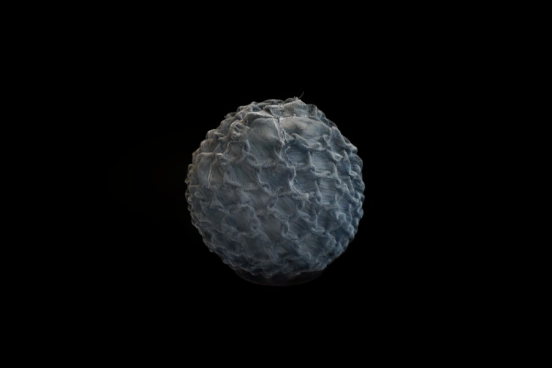
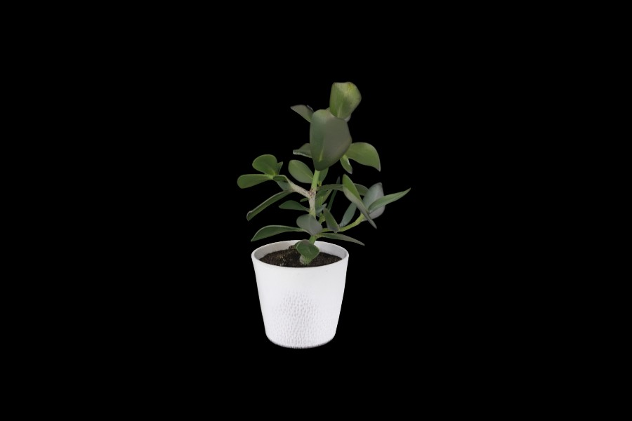
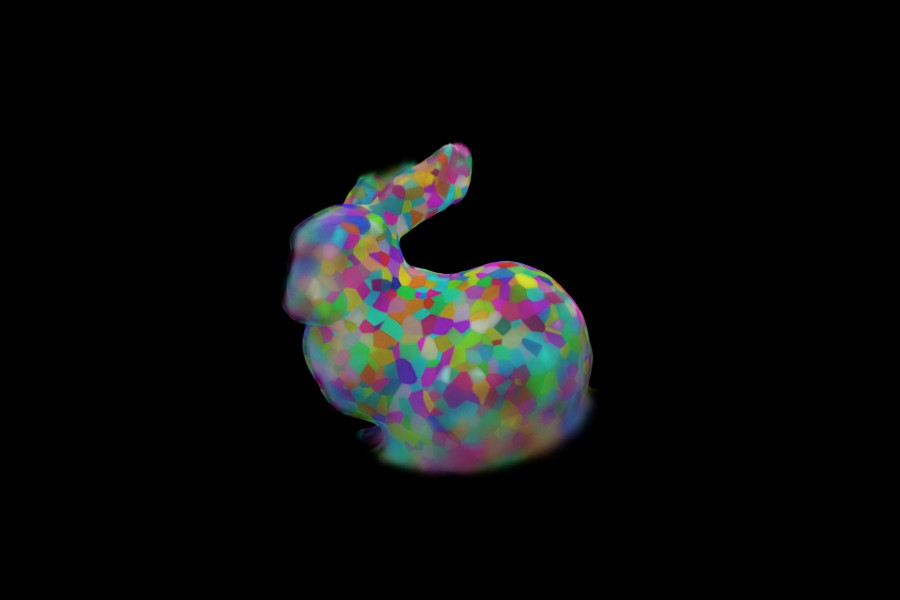
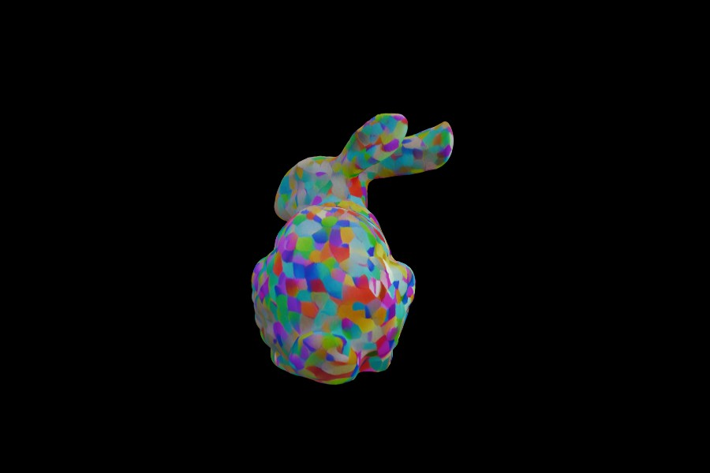
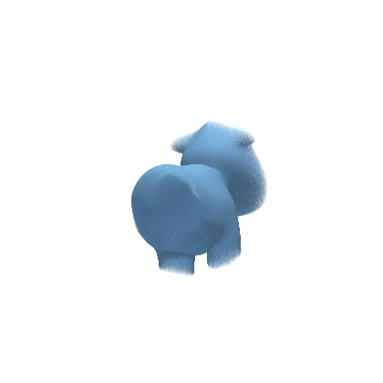
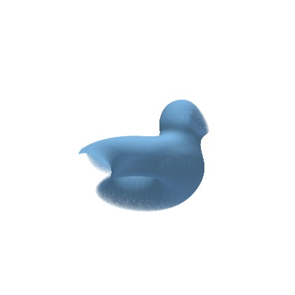
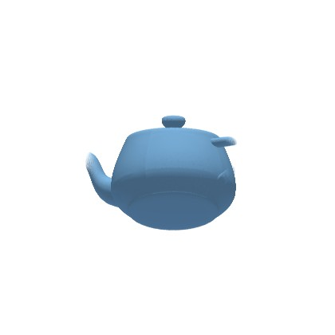
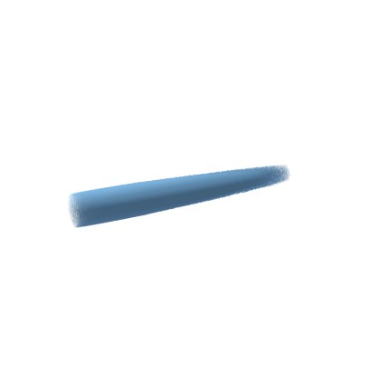
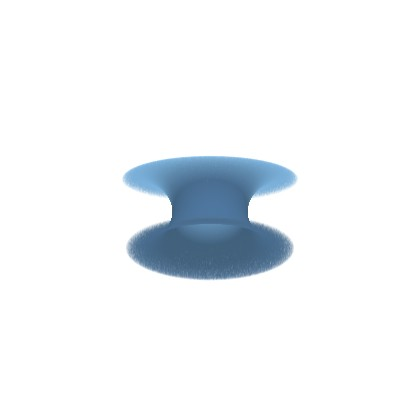
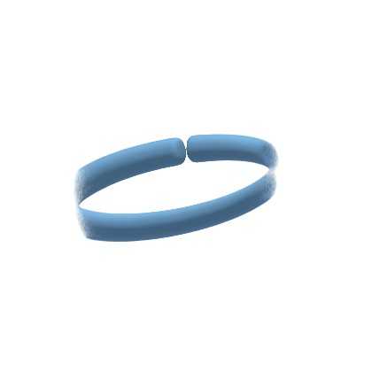

# splats

A small, hand-cleaned collection of everyday objects scanned as 3D Gaussian splats, free to use.

Every object here was captured, trained and cleaned by one person, so expect a
handful of them rather than thousands. Each is a real capture with its real
quirks, and each ships with its capture conditions, pipeline settings and known
caveats written down next to it.

[Browse in your browser](https://marcelpadilla.github.io/Projects/Gaussian_Splat_Object_Dataset/)
&nbsp;·&nbsp;
[Cite](#citing)
&nbsp;·&nbsp;
[License](#licensing)

## Use it from Python

```bash
pip install padillasplats
```

```python
import padillasplats as ps

s = ps.load("plant")     # downloads once, caches, verifies the checksum, decodes
s.positions              # (113648, 3) float32
s.colors                 # (113648, 4) uint8 RGBA

for s in ps.load_all(category="object"):   # loop over the whole collection
    print(s.id, len(s))
```

Filtering runs against a bundled inventory, so it is offline and instant, and
nothing downloads until you load:

```python
ps.find(category="object", min_splats=100_000)
ps.find(source_method="capture")     # real scans only, not generated
ps.find(open_license=True)           # only the freely-licensed objects
ps.find(tags=["plant"])
ps.download("./scans", open_license=True)   # local copies, safe licenses only
```

Every object also carries its license, so you can stay on the safe side of the
rights in one line: `open_license=True` drops the as-is generated objects (whose
provenance is unsettled), and `ps.is_open_license("<id>")` checks a single one.

Full package docs: [python/README.md](python/README.md).

## Download

- **Everything, as a zip:** [main.zip](https://github.com/marcelpadilla/splats/archive/refs/heads/main.zip)
  (the whole repository, `data/` included).
- **One object at a time:** the download links in the table below, or
  `data/<id>/<id>.splat` in the tree.
- **From Python:** `ps.download("./splats")`, or `ps.load("<id>")` to get it
  straight into numpy.

## The collection

Every object carries a **Kind** (`object` or `scene`, what it is) and a
**Source** (how it was made): `capture` (Scanned) is real photogrammetry from a
phone video, `synthetic-render` (Rendered) is trained from renders of a known 3D
asset, and `image-to-3d-generation` (Generated) is invented by a model from a
single image. The license sits under each Source, because it depends on how the
object was made (see [Licensing](#licensing)).

<!-- inventory:start -->
| | Object | Source | Kind | Size | Download |
|---|---|---|---|--:|:--:|
|  | **Houseplant**<br><sub>`plant`</sub><br><sub>plant, houseplant, foliage, organic, indoor, glossy</sub> | Scanned<br><sub>CC-BY-4.0</sub> | Object | ~113k · 3.6 MB | [.splat](https://raw.githubusercontent.com/marcelpadilla/splats/main/data/plant/plant.splat) · [meta](data/plant/meta.json) |
|  | **Academic Tarot Cards box**<br><sub>`academic_tarot_cards`</sub><br><sub>box, packaging, cardboard, print, indoor, boxy</sub> | Scanned<br><sub>CC-BY-4.0</sub> | Object | ~114k · 3.7 MB | [.splat](https://raw.githubusercontent.com/marcelpadilla/splats/main/data/academic_tarot_cards/academic_tarot_cards.splat) · [meta](data/academic_tarot_cards/meta.json) |
|  | **Textile ball**<br><sub>`textile_ball`</sub><br><sub>ball, textile, fabric, sphere, decor, bumpy</sub> | Scanned<br><sub>CC-BY-4.0</sub> | Object | ~384k · 12.3 MB | [.splat](https://raw.githubusercontent.com/marcelpadilla/splats/main/data/textile_ball/textile_ball.splat) · [meta](data/textile_ball/meta.json) |
|  | **Houseplant (generated)**<br><sub>`plant_generated`</sub><br><sub>plant, houseplant, foliage, generated, ai, single-image</sub> | Generated<br><sub>As-is (no warranty)</sub> | Object | ~262k · 8.4 MB | [.splat](https://raw.githubusercontent.com/marcelpadilla/splats/main/data/plant_generated/plant_generated.splat) · [meta](data/plant_generated/meta.json) |
|  | **Stanford bunny (rendered)**<br><sub>`bunny_render`</sub><br><sub>bunny, stanford-bunny, rendered, synthetic, test-model</sub> | Rendered<br><sub>CC-BY-3.0</sub> | Object | ~185k · 6.0 MB | [.splat](https://raw.githubusercontent.com/marcelpadilla/splats/main/data/bunny_render/bunny_render.splat) · [meta](data/bunny_render/meta.json) |
|  | **Stanford bunny (generated)**<br><sub>`bunny_generated`</sub><br><sub>bunny, stanford-bunny, generated, ai, test-model, single-image</sub> | Generated<br><sub>As-is (no warranty)</sub> | Object | ~262k · 8.4 MB | [.splat](https://raw.githubusercontent.com/marcelpadilla/splats/main/data/bunny_generated/bunny_generated.splat) · [meta](data/bunny_generated/meta.json) |
|  | **Spot**<br><sub>`spot`</sub><br><sub>cow, keenan-crane, classic, test-model, cute</sub> | Geometry<br><sub>CC0-1.0</sub> | Object | ~10k · 320 kB<br>~100k · 3.2 MB<br>~500k · 16.0 MB<br>~1000k · 32.0 MB | [10k](https://raw.githubusercontent.com/marcelpadilla/splats/main/data/spot/spot_10k.splat) · [100k](https://raw.githubusercontent.com/marcelpadilla/splats/main/data/spot/spot_100k.splat) · [500k](https://raw.githubusercontent.com/marcelpadilla/splats/main/data/spot/spot_500k.splat) · [1m](https://raw.githubusercontent.com/marcelpadilla/splats/main/data/spot/spot_1m.splat)<br><sub>[meta](data/spot/meta.json)</sub> |
|  | **Bob**<br><sub>`bob`</sub><br><sub>blob, keenan-crane, classic, test-model</sub> | Geometry<br><sub>CC0-1.0</sub> | Object | ~10k · 320 kB<br>~100k · 3.2 MB<br>~500k · 16.0 MB<br>~1000k · 32.0 MB | [10k](https://raw.githubusercontent.com/marcelpadilla/splats/main/data/bob/bob_10k.splat) · [100k](https://raw.githubusercontent.com/marcelpadilla/splats/main/data/bob/bob_100k.splat) · [500k](https://raw.githubusercontent.com/marcelpadilla/splats/main/data/bob/bob_500k.splat) · [1m](https://raw.githubusercontent.com/marcelpadilla/splats/main/data/bob/bob_1m.splat)<br><sub>[meta](data/bob/meta.json)</sub> |
|  | **Utah Teapot**<br><sub>`teapot`</sub><br><sub>teapot, utah, classic, newell</sub> | Geometry<br><sub>Public Domain</sub> | Object | ~10k · 320 kB<br>~100k · 3.2 MB<br>~500k · 16.0 MB<br>~1000k · 32.0 MB | [10k](https://raw.githubusercontent.com/marcelpadilla/splats/main/data/teapot/teapot_10k.splat) · [100k](https://raw.githubusercontent.com/marcelpadilla/splats/main/data/teapot/teapot_100k.splat) · [500k](https://raw.githubusercontent.com/marcelpadilla/splats/main/data/teapot/teapot_500k.splat) · [1m](https://raw.githubusercontent.com/marcelpadilla/splats/main/data/teapot/teapot_1m.splat)<br><sub>[meta](data/teapot/meta.json)</sub> |
|  | **Cylinder**<br><sub>`cylinder`</sub><br><sub>primitive, cylinder</sub> | Geometry<br><sub>CC0-1.0</sub> | Object | ~10k · 320 kB<br>~100k · 3.2 MB<br>~500k · 16.0 MB<br>~1000k · 32.0 MB | [10k](https://raw.githubusercontent.com/marcelpadilla/splats/main/data/cylinder/cylinder_10k.splat) · [100k](https://raw.githubusercontent.com/marcelpadilla/splats/main/data/cylinder/cylinder_100k.splat) · [500k](https://raw.githubusercontent.com/marcelpadilla/splats/main/data/cylinder/cylinder_500k.splat) · [1m](https://raw.githubusercontent.com/marcelpadilla/splats/main/data/cylinder/cylinder_1m.splat)<br><sub>[meta](data/cylinder/meta.json)</sub> |
|  | **Torus**<br><sub>`torus`</sub><br><sub>primitive, torus, donut</sub> | Geometry<br><sub>CC0-1.0</sub> | Object | ~10k · 320 kB<br>~100k · 3.2 MB<br>~500k · 16.0 MB<br>~1000k · 32.0 MB | [10k](https://raw.githubusercontent.com/marcelpadilla/splats/main/data/torus/torus_10k.splat) · [100k](https://raw.githubusercontent.com/marcelpadilla/splats/main/data/torus/torus_100k.splat) · [500k](https://raw.githubusercontent.com/marcelpadilla/splats/main/data/torus/torus_500k.splat) · [1m](https://raw.githubusercontent.com/marcelpadilla/splats/main/data/torus/torus_1m.splat)<br><sub>[meta](data/torus/meta.json)</sub> |
|  | **Ring**<br><sub>`ring`</sub><br><sub>primitive, ring, torus</sub> | Geometry<br><sub>CC0-1.0</sub> | Object | ~10k · 320 kB<br>~100k · 3.2 MB<br>~500k · 16.0 MB<br>~1000k · 32.0 MB | [10k](https://raw.githubusercontent.com/marcelpadilla/splats/main/data/ring/ring_10k.splat) · [100k](https://raw.githubusercontent.com/marcelpadilla/splats/main/data/ring/ring_100k.splat) · [500k](https://raw.githubusercontent.com/marcelpadilla/splats/main/data/ring/ring_500k.splat) · [1m](https://raw.githubusercontent.com/marcelpadilla/splats/main/data/ring/ring_1m.splat)<br><sub>[meta](data/ring/meta.json)</sub> |

<sub>12 objects · ~4323k gaussians · 138.3 MB total · licenses per object (see Source)</sub>
<!-- inventory:end -->

The machine-readable index of all of this is
[`data/inventory.json`](data/inventory.json): one record per object with its
checksum, dimensions, tags, category and source method. It is the single source
of truth that drives the table above, the website, and the Python package.

## Format

One `.splat` per object, the antimatter15 packing: a header-less array of
32-byte records, so the gaussian count is exactly `filesize // 32`.

| bytes | type | meaning |
|---|---|---|
| `0:12` | 3x float32 | position x, y, z |
| `12:24` | 3x float32 | scale x, y, z, linear and already exponentiated |
| `24:28` | 4x uint8 | colour R, G, B, A, where A is opacity |
| `28:32` | 4x uint8 | rotation quaternion w, x, y, z, as `q * 128 + 128` |

Up is `-y`, following the Inria and Brush convention. Scale is the COLMAP
reconstruction scale and is **not metric**. Spherical harmonics are dropped
(SH degree 0), so there is no view-dependent shading, but the files stay small
and every browser viewer reads them.

There is nowhere inside a `.splat` to put metadata without breaking the
`filesize // 32` invariant every reader depends on, so metadata lives in
`data/inventory.json` and each object's `meta.json`, never in the splat itself.

## Citing

If you use these in your work, a citation is appreciated (and required by the
data license). The BibTeX is also available from Python as `ps.citation()`.

<!-- citation:start -->
```bibtex
@misc{padilla_splats,
  author       = {Marcel Padilla},
  title        = {splats: a small collection of Gaussian splat objects},
  year         = {2026},
  howpublished = {\url{https://github.com/marcelpadilla/splats}}
}
```
<!-- citation:end -->

## Licensing

The data license depends on how each object was made (shown under its **Source**
in the table above, and in each object's `meta.json`):

- **Scanned objects are [CC-BY-4.0](LICENSE).** Use them for anything, including
  commercially. You must credit the author.
- **Rendered objects take the license of the 3D model they were rendered from.**
  The rendered bunny is CC-BY-3.0 (Stanford Bunny STL by Makerbot, via Wikimedia
  Commons); credit that original author as well.
- **Generated objects are provided as-is, with no warranty of rights.** They were
  invented by an AI image-to-3D model whose training data is undisclosed, so their
  copyright status cannot be warranted and they are **not under CC-BY**. You are
  responsible for clearing any rights for your use. Filter them out with
  `ps.find(open_license=True)`.
- **The code in `python/` is [0BSD](python/LICENSE).** No attribution required.

Credit line you can paste for a CC-BY object:

> Gaussian splat by Marcel Padilla, from https://github.com/marcelpadilla/splats, licensed CC-BY-4.0.

The license covers the capture, render or generation and the reconstruction, not
the industrial design of any object depicted.

## Layout

```
data/
  inventory.json          the machine-readable index, and the source of truth
  <id>/
    <id>.splat            the gaussians
    meta.json             capture, pipeline, quality, caveats
    thumb.jpg             the gallery image above
python/                   the padillasplats package
LICENSE                   CC-BY-4.0, for the data
```

## Adding an object

1. Put `data/<id>/<id>.splat`, its `meta.json` and a `thumb.jpg` in place.
2. Add an entry to `data/inventory.json`, including its SHA-256, `category` and
   `source_method`.
3. Run `python python/sync_inventory.py`, which refreshes the copy bundled in
   the package and regenerates the gallery and citation blocks above.
4. Run `python -m pytest python/tests` to confirm the checksums and counts agree.

The website reads `data/inventory.json` straight from this repository, and
existing package installs pick up new objects with `ps.refresh_inventory()`, so
neither needs a separate update.
