# splats

A free collection of objects as 3D Gaussian splats, each labelled with how it
was made.

Three ways of making one, in one place: most of them **generated** by an AI model
from a single freely-licensed photograph, a large set of classic meshes converted
straight **from geometry** at four resolutions each, and a few everyday things
**scanned** from phone video. Everything here was made and labelled by one
person, so expect a hundred objects rather than a hundred thousand. Each ships
with how it was made, its pipeline settings, its license and its known caveats
written down next to it.

[Browse in your browser](https://marcelpadilla.github.io/Projects/Gaussian_Splat_Object_Dataset/)
&nbsp;·&nbsp;
[Cite](#citing)
&nbsp;·&nbsp;
[License](#licensing)

## Use it from Python

```bash
pip install splatset
```

```python
import splatset

s = splatset.load("plant")  # downloads once, caches, verifies the checksum, decodes
s.positions                 # (113648, 3) float32
s.colors                    # (113648, 4) uint8 RGBA

for s in splatset.load_all(category="object"):   # loop over the whole collection
    print(s.id, len(s))
```

Filtering runs against a bundled inventory, so it is offline and instant, and
nothing downloads until you load:

```python
splatset.find(category="object", min_splats=100_000)
splatset.find(source_method="capture")     # real scans only, not generated
splatset.find(open_license=True)           # only the freely-licensed objects
splatset.find(tags=["plant"])
splatset.download("./scans", open_license=True)   # local copies, safe licenses only
```

The mesh-derived objects ship at **10k / 100k / 500k / 1M** gaussians, and every
download path takes the tier you want, so you never assemble a URL:

```python
splatset.load("lucy", lod="10k")                        # one object, small tier
splatset.find(source_method="mesh2splat", lod="10k")    # everything that has a 10k tier
splatset.download("./small", lod="min")                 # the smallest of each object
splatset.load_random(source_method="capture")           # or just give me one
```

Every object also carries its license, so you can stay on the safe side of the
rights in one line: `open_license=True` keeps only what has no condition
attached, and `splatset.is_open_license("<id>")` checks a single one.
`print(splatset.summary())` prints the whole picture.

There is a command line too:

```bash
python -m splatset list --source mesh2splat --lod 10k
python -m splatset get lucy --lod 1m
```

Full package docs: [python/README.md](python/README.md).

## Download

- **Everything, as a zip:** [main.zip](https://github.com/marcelpadilla/splats/archive/refs/heads/main.zip)
  (the whole repository, `data/` included).
- **One object at a time:** the download links in the table below, or
  `data/<id>/<id>.splat` in the tree.
- **From Python:** `splatset.download("./splats")`, or `splatset.load("<id>")`
  to get one straight into numpy.

## The collection

Every object carries a **Kind** (`object` or `scene`, what it is) and a
**Source** (how it was made): `capture` (Scanned) is real photogrammetry from a
phone video, `mesh2splat` (Geometry) is converted directly from a known mesh with
no photography and no training, `synthetic-render` (Rendered) is trained from
renders of a known 3D asset, and `image-to-3d-generation` (Generated) is invented
by a model from a single image. The license sits under each Source, because it
depends on how the object was made (see [Licensing](#licensing)).

Geometry objects list four levels of detail with a download link each; the colour
of a mesh2splat object encodes its tier (10k red, 100k yellow, 500k green, 1M
blue), so you can see at a glance which resolution you are looking at.

<!-- inventory:start -->
| | Object | Source | Kind | Size | Download |
|---|---|---|---|--:|:--:|
| 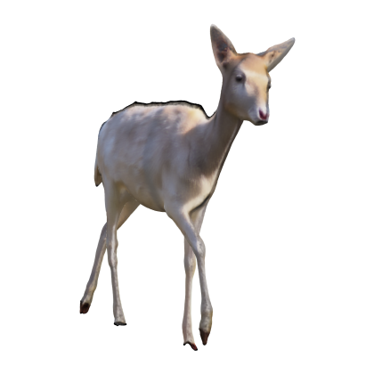 | **Fallow deer (generated)**<br><sub>`fallow_deer_generated`</sub><br><sub>deer, fallow-deer, dama-dama, animal, mammal, wildlife, generated, ai, single-image</sub> | Generated<br><sub>As-is (no warranty)</sub> | Object | ~262k · 8.4 MB | [.splat](https://raw.githubusercontent.com/marcelpadilla/splats/main/data/fallow_deer_generated/fallow_deer_generated.splat) · [meta](data/fallow_deer_generated/meta.json) |
| 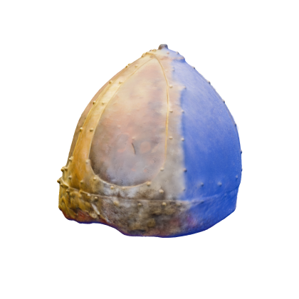 | **Gilded helmet (generated)**<br><sub>`gilded_helmet_generated`</sub><br><sub>helmet, armour, gilded, islamic, museum, antique, generated, ai, single-image</sub> | Generated<br><sub>As-is (no warranty)</sub> | Object | ~262k · 8.4 MB | [.splat](https://raw.githubusercontent.com/marcelpadilla/splats/main/data/gilded_helmet_generated/gilded_helmet_generated.splat) · [meta](data/gilded_helmet_generated/meta.json) |
| 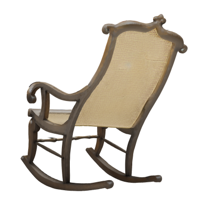 | **Rocking chair (generated)**<br><sub>`rocking_chair_generated`</sub><br><sub>chair, rocking-chair, furniture, cane, wood, generated, ai, single-image</sub> | Generated<br><sub>As-is (no warranty)</sub> | Object | ~262k · 8.4 MB | [.splat](https://raw.githubusercontent.com/marcelpadilla/splats/main/data/rocking_chair_generated/rocking_chair_generated.splat) · [meta](data/rocking_chair_generated/meta.json) |
| 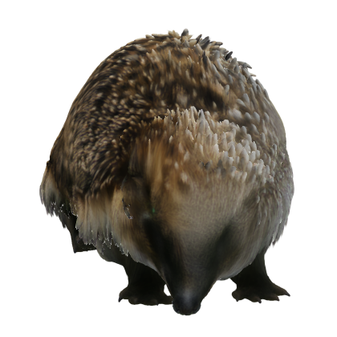 | **Hedgehog (generated)**<br><sub>`hedgehog_generated`</sub><br><sub>hedgehog, animal, mammal, spines, wildlife, generated, ai, single-image</sub> | Generated<br><sub>As-is (no warranty)</sub> | Object | ~262k · 8.4 MB | [.splat](https://raw.githubusercontent.com/marcelpadilla/splats/main/data/hedgehog_generated/hedgehog_generated.splat) · [meta](data/hedgehog_generated/meta.json) |
| 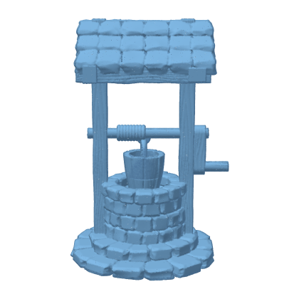 | **Well**<br><sub>`well`</sub><br><sub>well, building, architecture, medieval</sub> | Geometry<br><sub>CC-BY-NC-4.0</sub> | Object | ~10k · 320 kB<br>~100k · 3.2 MB<br>~500k · 16.0 MB<br>~1M · 32.0 MB | [10k](https://raw.githubusercontent.com/marcelpadilla/splats/main/data/well/well_10k.splat) · [100k](https://raw.githubusercontent.com/marcelpadilla/splats/main/data/well/well_100k.splat) · [500k](https://raw.githubusercontent.com/marcelpadilla/splats/main/data/well/well_500k.splat) · [1m](https://raw.githubusercontent.com/marcelpadilla/splats/main/data/well/well_1m.splat)<br><sub>[meta](data/well/meta.json)</sub> |
| 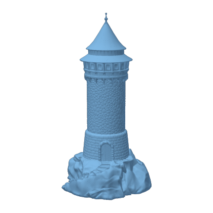 | **Tower**<br><sub>`tower`</sub><br><sub>tower, building, architecture, lighthouse</sub> | Geometry<br><sub>CC-BY-NC-3.0</sub> | Object | ~10k · 320 kB<br>~100k · 3.2 MB<br>~500k · 16.0 MB<br>~1M · 32.0 MB | [10k](https://raw.githubusercontent.com/marcelpadilla/splats/main/data/tower/tower_10k.splat) · [100k](https://raw.githubusercontent.com/marcelpadilla/splats/main/data/tower/tower_100k.splat) · [500k](https://raw.githubusercontent.com/marcelpadilla/splats/main/data/tower/tower_500k.splat) · [1m](https://raw.githubusercontent.com/marcelpadilla/splats/main/data/tower/tower_1m.splat)<br><sub>[meta](data/tower/meta.json)</sub> |
| 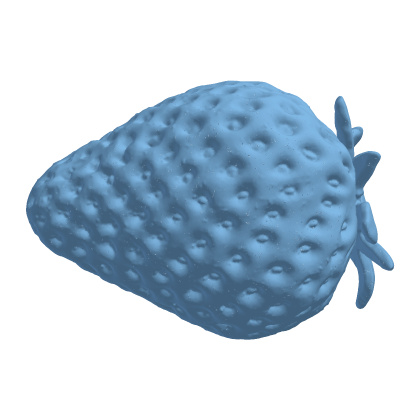 | **Strawberry**<br><sub>`strawberry`</sub><br><sub>strawberry, fruit, food</sub> | Geometry<br><sub>CC-BY-NC-4.0</sub> | Object | ~10k · 320 kB<br>~100k · 3.2 MB<br>~500k · 16.0 MB<br>~1M · 32.0 MB | [10k](https://raw.githubusercontent.com/marcelpadilla/splats/main/data/strawberry/strawberry_10k.splat) · [100k](https://raw.githubusercontent.com/marcelpadilla/splats/main/data/strawberry/strawberry_100k.splat) · [500k](https://raw.githubusercontent.com/marcelpadilla/splats/main/data/strawberry/strawberry_500k.splat) · [1m](https://raw.githubusercontent.com/marcelpadilla/splats/main/data/strawberry/strawberry_1m.splat)<br><sub>[meta](data/strawberry/meta.json)</sub> |
| 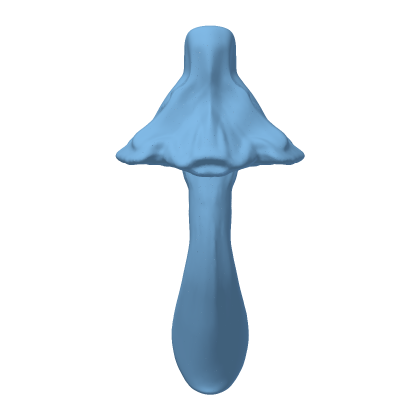 | **Mushroom**<br><sub>`mushroom`</sub><br><sub>mushroom, fungus, nature, plant</sub> | Geometry<br><sub>CC-BY-NC-4.0</sub> | Object | ~10k · 320 kB<br>~100k · 3.2 MB<br>~500k · 16.0 MB<br>~1M · 32.0 MB | [10k](https://raw.githubusercontent.com/marcelpadilla/splats/main/data/mushroom/mushroom_10k.splat) · [100k](https://raw.githubusercontent.com/marcelpadilla/splats/main/data/mushroom/mushroom_100k.splat) · [500k](https://raw.githubusercontent.com/marcelpadilla/splats/main/data/mushroom/mushroom_500k.splat) · [1m](https://raw.githubusercontent.com/marcelpadilla/splats/main/data/mushroom/mushroom_1m.splat)<br><sub>[meta](data/mushroom/meta.json)</sub> |
| 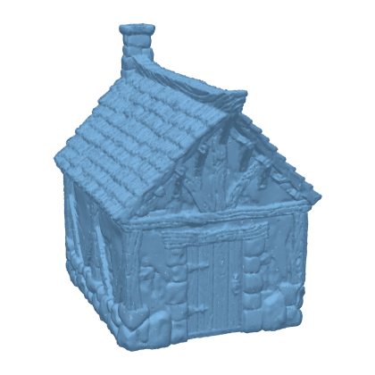 | **House**<br><sub>`house`</sub><br><sub>house, building, architecture, cottage</sub> | Geometry<br><sub>CC-BY-NC-4.0</sub> | Object | ~10k · 320 kB<br>~100k · 3.2 MB<br>~500k · 16.0 MB<br>~1M · 32.0 MB | [10k](https://raw.githubusercontent.com/marcelpadilla/splats/main/data/house/house_10k.splat) · [100k](https://raw.githubusercontent.com/marcelpadilla/splats/main/data/house/house_100k.splat) · [500k](https://raw.githubusercontent.com/marcelpadilla/splats/main/data/house/house_500k.splat) · [1m](https://raw.githubusercontent.com/marcelpadilla/splats/main/data/house/house_1m.splat)<br><sub>[meta](data/house/meta.json)</sub> |
| 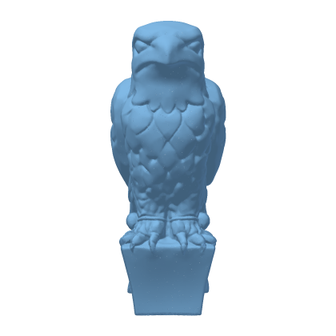 | **Falcon statue**<br><sub>`falconstatue`</sub><br><sub>falcon, bird, statue, sculpture</sub> | Geometry<br><sub>CC-BY-NC-SA-4.0</sub> | Object | ~10k · 320 kB<br>~100k · 3.2 MB<br>~500k · 16.0 MB<br>~1M · 32.0 MB | [10k](https://raw.githubusercontent.com/marcelpadilla/splats/main/data/falconstatue/falconstatue_10k.splat) · [100k](https://raw.githubusercontent.com/marcelpadilla/splats/main/data/falconstatue/falconstatue_100k.splat) · [500k](https://raw.githubusercontent.com/marcelpadilla/splats/main/data/falconstatue/falconstatue_500k.splat) · [1m](https://raw.githubusercontent.com/marcelpadilla/splats/main/data/falconstatue/falconstatue_1m.splat)<br><sub>[meta](data/falconstatue/meta.json)</sub> |
| 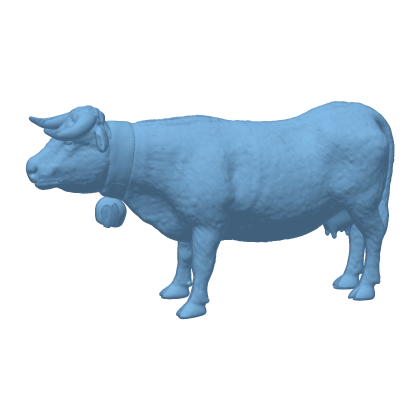 | **Cow**<br><sub>`cow`</sub><br><sub>cow, animal, farm, cattle</sub> | Geometry<br><sub>CC-BY-NC-4.0</sub> | Object | ~10k · 320 kB<br>~100k · 3.2 MB<br>~500k · 16.0 MB<br>~1M · 32.0 MB | [10k](https://raw.githubusercontent.com/marcelpadilla/splats/main/data/cow/cow_10k.splat) · [100k](https://raw.githubusercontent.com/marcelpadilla/splats/main/data/cow/cow_100k.splat) · [500k](https://raw.githubusercontent.com/marcelpadilla/splats/main/data/cow/cow_500k.splat) · [1m](https://raw.githubusercontent.com/marcelpadilla/splats/main/data/cow/cow_1m.splat)<br><sub>[meta](data/cow/meta.json)</sub> |
| 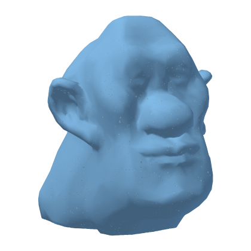 | **Brucewick**<br><sub>`brucewick`</sub><br><sub>bust, head, portrait, character</sub> | Geometry<br><sub>CC-BY-NC-4.0</sub> | Object | ~10k · 320 kB<br>~100k · 3.2 MB<br>~500k · 16.0 MB<br>~1M · 32.0 MB | [10k](https://raw.githubusercontent.com/marcelpadilla/splats/main/data/brucewick/brucewick_10k.splat) · [100k](https://raw.githubusercontent.com/marcelpadilla/splats/main/data/brucewick/brucewick_100k.splat) · [500k](https://raw.githubusercontent.com/marcelpadilla/splats/main/data/brucewick/brucewick_500k.splat) · [1m](https://raw.githubusercontent.com/marcelpadilla/splats/main/data/brucewick/brucewick_1m.splat)<br><sub>[meta](data/brucewick/meta.json)</sub> |
| 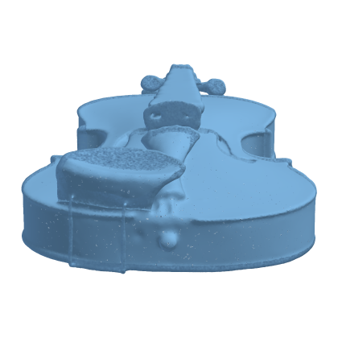 | **Violin**<br><sub>`violin`</sub><br><sub>violin, instrument, music, scan</sub> | Geometry<br><sub>CC0-1.0</sub> | Object | ~10k · 320 kB<br>~100k · 3.2 MB<br>~500k · 16.0 MB<br>~1M · 32.0 MB | [10k](https://raw.githubusercontent.com/marcelpadilla/splats/main/data/violin/violin_10k.splat) · [100k](https://raw.githubusercontent.com/marcelpadilla/splats/main/data/violin/violin_100k.splat) · [500k](https://raw.githubusercontent.com/marcelpadilla/splats/main/data/violin/violin_500k.splat) · [1m](https://raw.githubusercontent.com/marcelpadilla/splats/main/data/violin/violin_1m.splat)<br><sub>[meta](data/violin/meta.json)</sub> |
| 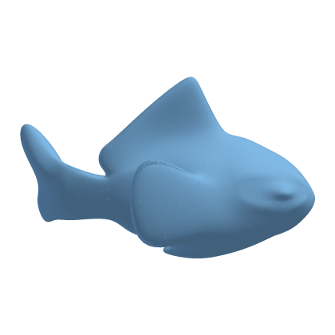 | **Fish**<br><sub>`fish`</sub><br><sub>fish, animal, sea</sub> | Geometry<br><sub>Public Domain</sub> | Object | ~10k · 320 kB<br>~100k · 3.2 MB<br>~500k · 16.0 MB<br>~1M · 32.0 MB | [10k](https://raw.githubusercontent.com/marcelpadilla/splats/main/data/fish/fish_10k.splat) · [100k](https://raw.githubusercontent.com/marcelpadilla/splats/main/data/fish/fish_100k.splat) · [500k](https://raw.githubusercontent.com/marcelpadilla/splats/main/data/fish/fish_500k.splat) · [1m](https://raw.githubusercontent.com/marcelpadilla/splats/main/data/fish/fish_1m.splat)<br><sub>[meta](data/fish/meta.json)</sub> |
| 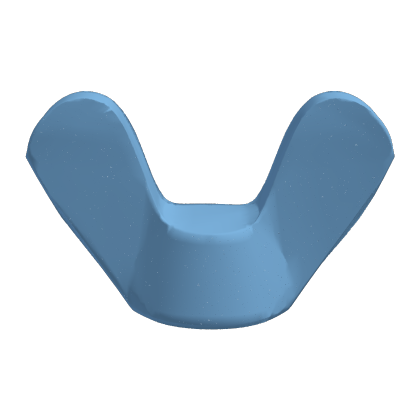 | **Wing nut**<br><sub>`wingnut`</sub><br><sub>wingnut, hardware, cad, nut</sub> | Geometry<br><sub>CC-BY-4.0</sub> | Object | ~10k · 320 kB<br>~100k · 3.2 MB<br>~500k · 16.0 MB<br>~1M · 32.0 MB | [10k](https://raw.githubusercontent.com/marcelpadilla/splats/main/data/wingnut/wingnut_10k.splat) · [100k](https://raw.githubusercontent.com/marcelpadilla/splats/main/data/wingnut/wingnut_100k.splat) · [500k](https://raw.githubusercontent.com/marcelpadilla/splats/main/data/wingnut/wingnut_500k.splat) · [1m](https://raw.githubusercontent.com/marcelpadilla/splats/main/data/wingnut/wingnut_1m.splat)<br><sub>[meta](data/wingnut/meta.json)</sub> |
| 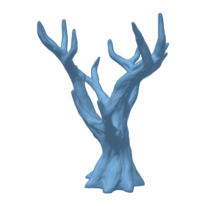 | **Tree**<br><sub>`tree`</sub><br><sub>tree, plant, nature, branches</sub> | Geometry<br><sub>CC-BY-4.0</sub> | Object | ~10k · 320 kB<br>~100k · 3.2 MB<br>~500k · 16.0 MB<br>~1M · 32.0 MB | [10k](https://raw.githubusercontent.com/marcelpadilla/splats/main/data/tree/tree_10k.splat) · [100k](https://raw.githubusercontent.com/marcelpadilla/splats/main/data/tree/tree_100k.splat) · [500k](https://raw.githubusercontent.com/marcelpadilla/splats/main/data/tree/tree_500k.splat) · [1m](https://raw.githubusercontent.com/marcelpadilla/splats/main/data/tree/tree_1m.splat)<br><sub>[meta](data/tree/meta.json)</sub> |
| 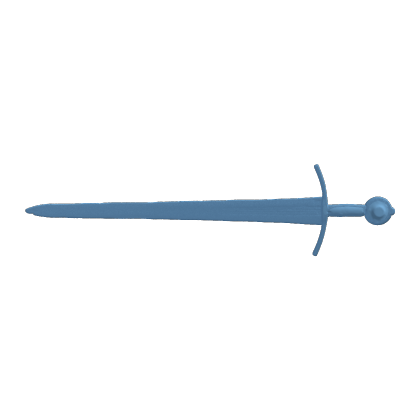 | **Sword**<br><sub>`sword`</sub><br><sub>sword, weapon, blade, historical</sub> | Geometry<br><sub>CC-BY-4.0</sub> | Object | ~10k · 320 kB<br>~100k · 3.2 MB<br>~500k · 16.0 MB<br>~1M · 32.0 MB | [10k](https://raw.githubusercontent.com/marcelpadilla/splats/main/data/sword/sword_10k.splat) · [100k](https://raw.githubusercontent.com/marcelpadilla/splats/main/data/sword/sword_100k.splat) · [500k](https://raw.githubusercontent.com/marcelpadilla/splats/main/data/sword/sword_500k.splat) · [1m](https://raw.githubusercontent.com/marcelpadilla/splats/main/data/sword/sword_1m.splat)<br><sub>[meta](data/sword/meta.json)</sub> |
| 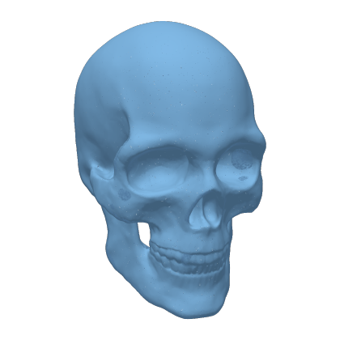 | **Skull**<br><sub>`skull`</sub><br><sub>skull, anatomy, bone, head</sub> | Geometry<br><sub>CC-BY-3.0</sub> | Object | ~10k · 320 kB<br>~100k · 3.2 MB<br>~500k · 16.0 MB<br>~1M · 32.0 MB | [10k](https://raw.githubusercontent.com/marcelpadilla/splats/main/data/skull/skull_10k.splat) · [100k](https://raw.githubusercontent.com/marcelpadilla/splats/main/data/skull/skull_100k.splat) · [500k](https://raw.githubusercontent.com/marcelpadilla/splats/main/data/skull/skull_500k.splat) · [1m](https://raw.githubusercontent.com/marcelpadilla/splats/main/data/skull/skull_1m.splat)<br><sub>[meta](data/skull/meta.json)</sub> |
| 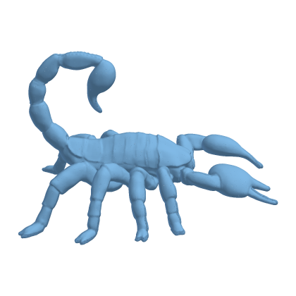 | **Scorpion**<br><sub>`scorpion`</sub><br><sub>scorpion, animal, arachnid, detailed</sub> | Geometry<br><sub>CC-BY-3.0</sub> | Object | ~10k · 320 kB<br>~100k · 3.2 MB<br>~500k · 16.0 MB<br>~1M · 32.0 MB | [10k](https://raw.githubusercontent.com/marcelpadilla/splats/main/data/scorpion/scorpion_10k.splat) · [100k](https://raw.githubusercontent.com/marcelpadilla/splats/main/data/scorpion/scorpion_100k.splat) · [500k](https://raw.githubusercontent.com/marcelpadilla/splats/main/data/scorpion/scorpion_500k.splat) · [1m](https://raw.githubusercontent.com/marcelpadilla/splats/main/data/scorpion/scorpion_1m.splat)<br><sub>[meta](data/scorpion/meta.json)</sub> |
|  | **Plane**<br><sub>`plane`</sub><br><sub>plane, aircraft, airplane, vehicle</sub> | Geometry<br><sub>CC-BY-3.0</sub> | Object | ~10k · 320 kB<br>~100k · 3.2 MB<br>~500k · 16.0 MB<br>~1M · 32.0 MB | [10k](https://raw.githubusercontent.com/marcelpadilla/splats/main/data/plane/plane_10k.splat) · [100k](https://raw.githubusercontent.com/marcelpadilla/splats/main/data/plane/plane_100k.splat) · [500k](https://raw.githubusercontent.com/marcelpadilla/splats/main/data/plane/plane_500k.splat) · [1m](https://raw.githubusercontent.com/marcelpadilla/splats/main/data/plane/plane_1m.splat)<br><sub>[meta](data/plane/meta.json)</sub> |
| 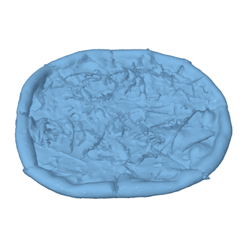 | **Pizza**<br><sub>`pizza`</sub><br><sub>pizza, food, flat</sub> | Geometry<br><sub>CC-BY-4.0</sub> | Object | ~10k · 320 kB<br>~100k · 3.2 MB<br>~500k · 16.0 MB<br>~1M · 32.0 MB | [10k](https://raw.githubusercontent.com/marcelpadilla/splats/main/data/pizza/pizza_10k.splat) · [100k](https://raw.githubusercontent.com/marcelpadilla/splats/main/data/pizza/pizza_100k.splat) · [500k](https://raw.githubusercontent.com/marcelpadilla/splats/main/data/pizza/pizza_500k.splat) · [1m](https://raw.githubusercontent.com/marcelpadilla/splats/main/data/pizza/pizza_1m.splat)<br><sub>[meta](data/pizza/meta.json)</sub> |
| 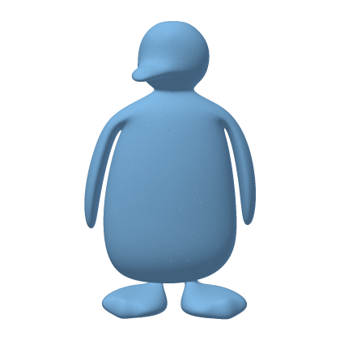 | **Penguin**<br><sub>`penguin`</sub><br><sub>penguin, animal, bird, cartoon</sub> | Geometry<br><sub>CC-BY-4.0</sub> | Object | ~10k · 320 kB<br>~100k · 3.2 MB<br>~500k · 16.0 MB<br>~1M · 32.0 MB | [10k](https://raw.githubusercontent.com/marcelpadilla/splats/main/data/penguin/penguin_10k.splat) · [100k](https://raw.githubusercontent.com/marcelpadilla/splats/main/data/penguin/penguin_100k.splat) · [500k](https://raw.githubusercontent.com/marcelpadilla/splats/main/data/penguin/penguin_500k.splat) · [1m](https://raw.githubusercontent.com/marcelpadilla/splats/main/data/penguin/penguin_1m.splat)<br><sub>[meta](data/penguin/meta.json)</sub> |
| 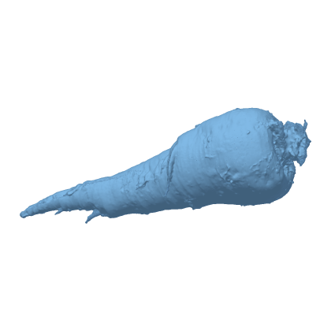 | **Parsnip**<br><sub>`parsnip`</sub><br><sub>parsnip, vegetable, food, root</sub> | Geometry<br><sub>CC-BY-4.0</sub> | Object | ~10k · 320 kB<br>~100k · 3.2 MB<br>~500k · 16.0 MB<br>~1M · 32.0 MB | [10k](https://raw.githubusercontent.com/marcelpadilla/splats/main/data/parsnip/parsnip_10k.splat) · [100k](https://raw.githubusercontent.com/marcelpadilla/splats/main/data/parsnip/parsnip_100k.splat) · [500k](https://raw.githubusercontent.com/marcelpadilla/splats/main/data/parsnip/parsnip_500k.splat) · [1m](https://raw.githubusercontent.com/marcelpadilla/splats/main/data/parsnip/parsnip_1m.splat)<br><sub>[meta](data/parsnip/meta.json)</sub> |
| 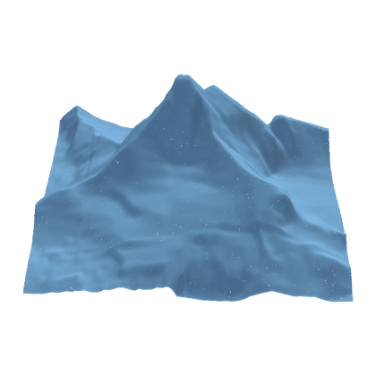 | **Mountain**<br><sub>`mountain`</sub><br><sub>mountain, terrain, landscape, peak</sub> | Geometry<br><sub>CC-BY-4.0</sub> | Object | ~10k · 320 kB<br>~100k · 3.2 MB<br>~500k · 16.0 MB<br>~1M · 32.0 MB | [10k](https://raw.githubusercontent.com/marcelpadilla/splats/main/data/mountain/mountain_10k.splat) · [100k](https://raw.githubusercontent.com/marcelpadilla/splats/main/data/mountain/mountain_100k.splat) · [500k](https://raw.githubusercontent.com/marcelpadilla/splats/main/data/mountain/mountain_500k.splat) · [1m](https://raw.githubusercontent.com/marcelpadilla/splats/main/data/mountain/mountain_1m.splat)<br><sub>[meta](data/mountain/meta.json)</sub> |
| 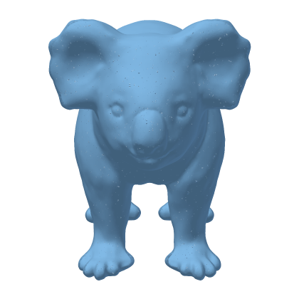 | **Koala**<br><sub>`koala`</sub><br><sub>koala, animal, bear</sub> | Geometry<br><sub>CC-BY-3.0</sub> | Object | ~10k · 320 kB<br>~100k · 3.2 MB<br>~500k · 16.0 MB<br>~1M · 32.0 MB | [10k](https://raw.githubusercontent.com/marcelpadilla/splats/main/data/koala/koala_10k.splat) · [100k](https://raw.githubusercontent.com/marcelpadilla/splats/main/data/koala/koala_100k.splat) · [500k](https://raw.githubusercontent.com/marcelpadilla/splats/main/data/koala/koala_500k.splat) · [1m](https://raw.githubusercontent.com/marcelpadilla/splats/main/data/koala/koala_1m.splat)<br><sub>[meta](data/koala/meta.json)</sub> |
| 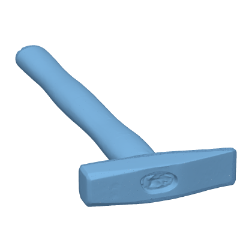 | **Hammer**<br><sub>`hammer`</sub><br><sub>hammer, tool, hardware</sub> | Geometry<br><sub>CC-BY-4.0</sub> | Object | ~10k · 320 kB<br>~100k · 3.2 MB<br>~500k · 16.0 MB<br>~1M · 32.0 MB | [10k](https://raw.githubusercontent.com/marcelpadilla/splats/main/data/hammer/hammer_10k.splat) · [100k](https://raw.githubusercontent.com/marcelpadilla/splats/main/data/hammer/hammer_100k.splat) · [500k](https://raw.githubusercontent.com/marcelpadilla/splats/main/data/hammer/hammer_500k.splat) · [1m](https://raw.githubusercontent.com/marcelpadilla/splats/main/data/hammer/hammer_1m.splat)<br><sub>[meta](data/hammer/meta.json)</sub> |
| 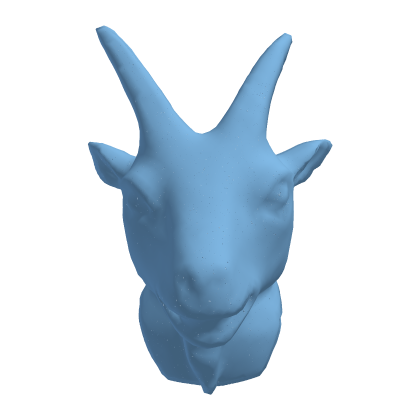 | **Goat head**<br><sub>`goathead`</sub><br><sub>goat, head, animal, horns</sub> | Geometry<br><sub>CC-BY-3.0</sub> | Object | ~10k · 320 kB<br>~100k · 3.2 MB<br>~500k · 16.0 MB<br>~1M · 32.0 MB | [10k](https://raw.githubusercontent.com/marcelpadilla/splats/main/data/goathead/goathead_10k.splat) · [100k](https://raw.githubusercontent.com/marcelpadilla/splats/main/data/goathead/goathead_100k.splat) · [500k](https://raw.githubusercontent.com/marcelpadilla/splats/main/data/goathead/goathead_500k.splat) · [1m](https://raw.githubusercontent.com/marcelpadilla/splats/main/data/goathead/goathead_1m.splat)<br><sub>[meta](data/goathead/meta.json)</sub> |
| 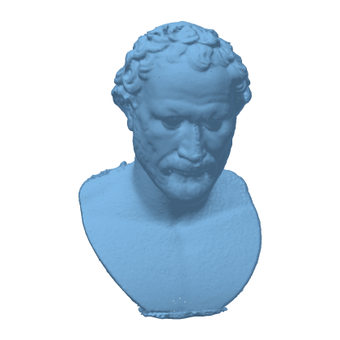 | **Demosthenes**<br><sub>`demosthenes`</sub><br><sub>bust, statue, sculpture, portrait, classical</sub> | Geometry<br><sub>CC-BY-4.0</sub> | Object | ~10k · 320 kB<br>~100k · 3.2 MB<br>~500k · 16.0 MB<br>~1M · 32.0 MB | [10k](https://raw.githubusercontent.com/marcelpadilla/splats/main/data/demosthenes/demosthenes_10k.splat) · [100k](https://raw.githubusercontent.com/marcelpadilla/splats/main/data/demosthenes/demosthenes_100k.splat) · [500k](https://raw.githubusercontent.com/marcelpadilla/splats/main/data/demosthenes/demosthenes_500k.splat) · [1m](https://raw.githubusercontent.com/marcelpadilla/splats/main/data/demosthenes/demosthenes_1m.splat)<br><sub>[meta](data/demosthenes/meta.json)</sub> |
| 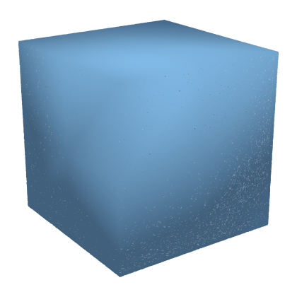 | **Cube**<br><sub>`cube`</sub><br><sub>cube, primitive, box</sub> | Geometry<br><sub>CC-BY-4.0</sub> | Object | ~10k · 320 kB<br>~100k · 3.2 MB<br>~500k · 16.0 MB<br>~1M · 32.0 MB | [10k](https://raw.githubusercontent.com/marcelpadilla/splats/main/data/cube/cube_10k.splat) · [100k](https://raw.githubusercontent.com/marcelpadilla/splats/main/data/cube/cube_100k.splat) · [500k](https://raw.githubusercontent.com/marcelpadilla/splats/main/data/cube/cube_500k.splat) · [1m](https://raw.githubusercontent.com/marcelpadilla/splats/main/data/cube/cube_1m.splat)<br><sub>[meta](data/cube/meta.json)</sub> |
| 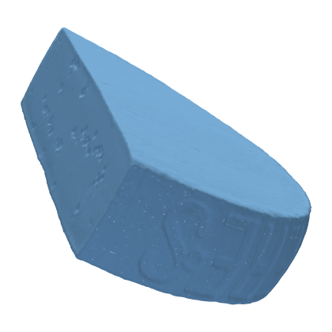 | **Cheese**<br><sub>`cheese`</sub><br><sub>cheese, food, wedge</sub> | Geometry<br><sub>CC-BY-4.0</sub> | Object | ~10k · 320 kB<br>~100k · 3.2 MB<br>~500k · 16.0 MB<br>~1M · 32.0 MB | [10k](https://raw.githubusercontent.com/marcelpadilla/splats/main/data/cheese/cheese_10k.splat) · [100k](https://raw.githubusercontent.com/marcelpadilla/splats/main/data/cheese/cheese_100k.splat) · [500k](https://raw.githubusercontent.com/marcelpadilla/splats/main/data/cheese/cheese_500k.splat) · [1m](https://raw.githubusercontent.com/marcelpadilla/splats/main/data/cheese/cheese_1m.splat)<br><sub>[meta](data/cheese/meta.json)</sub> |
| 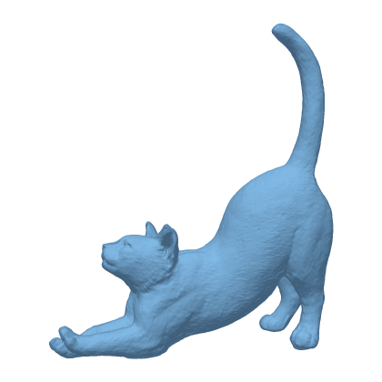 | **Cat**<br><sub>`cat`</sub><br><sub>cat, animal, pet, stretching</sub> | Geometry<br><sub>CC-BY-4.0</sub> | Object | ~10k · 320 kB<br>~100k · 3.2 MB<br>~500k · 16.0 MB<br>~1M · 32.0 MB | [10k](https://raw.githubusercontent.com/marcelpadilla/splats/main/data/cat/cat_10k.splat) · [100k](https://raw.githubusercontent.com/marcelpadilla/splats/main/data/cat/cat_100k.splat) · [500k](https://raw.githubusercontent.com/marcelpadilla/splats/main/data/cat/cat_500k.splat) · [1m](https://raw.githubusercontent.com/marcelpadilla/splats/main/data/cat/cat_1m.splat)<br><sub>[meta](data/cat/meta.json)</sub> |
| 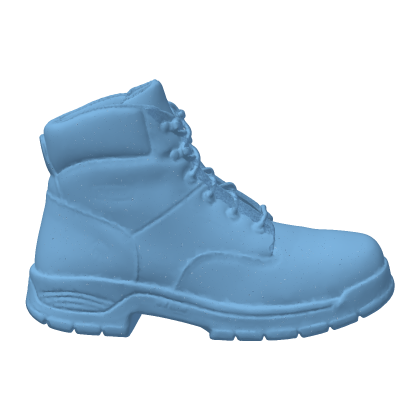 | **Boot**<br><sub>`boot`</sub><br><sub>boot, shoe, footwear, leather</sub> | Geometry<br><sub>CC-BY-4.0</sub> | Object | ~10k · 320 kB<br>~100k · 3.2 MB<br>~500k · 16.0 MB<br>~1M · 32.0 MB | [10k](https://raw.githubusercontent.com/marcelpadilla/splats/main/data/boot/boot_10k.splat) · [100k](https://raw.githubusercontent.com/marcelpadilla/splats/main/data/boot/boot_100k.splat) · [500k](https://raw.githubusercontent.com/marcelpadilla/splats/main/data/boot/boot_500k.splat) · [1m](https://raw.githubusercontent.com/marcelpadilla/splats/main/data/boot/boot_1m.splat)<br><sub>[meta](data/boot/meta.json)</sub> |
| 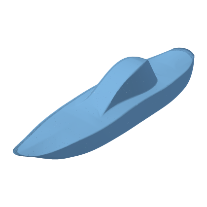 | **Boat**<br><sub>`boat`</sub><br><sub>boat, ship, vehicle, hull</sub> | Geometry<br><sub>CC-BY-4.0</sub> | Object | ~10k · 320 kB<br>~100k · 3.2 MB<br>~500k · 16.0 MB<br>~1M · 32.0 MB | [10k](https://raw.githubusercontent.com/marcelpadilla/splats/main/data/boat/boat_10k.splat) · [100k](https://raw.githubusercontent.com/marcelpadilla/splats/main/data/boat/boat_100k.splat) · [500k](https://raw.githubusercontent.com/marcelpadilla/splats/main/data/boat/boat_500k.splat) · [1m](https://raw.githubusercontent.com/marcelpadilla/splats/main/data/boat/boat_1m.splat)<br><sub>[meta](data/boat/meta.json)</sub> |
| 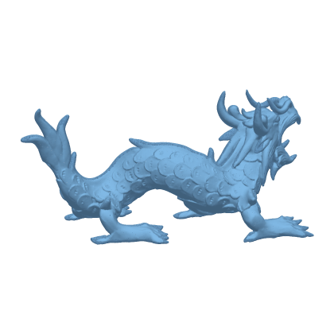 | **XYZ RGB Dragon**<br><sub>`xyzrgb_dragon`</sub><br><sub>dragon, stanford, xyz-rgb, test-model, detailed, high-poly</sub> | Geometry<br><sub>Stanford 3DSR (attribution)</sub> | Object | ~10k · 320 kB<br>~100k · 3.2 MB<br>~500k · 16.0 MB<br>~1M · 32.0 MB | [10k](https://raw.githubusercontent.com/marcelpadilla/splats/main/data/xyzrgb_dragon/xyzrgb_dragon_10k.splat) · [100k](https://raw.githubusercontent.com/marcelpadilla/splats/main/data/xyzrgb_dragon/xyzrgb_dragon_100k.splat) · [500k](https://raw.githubusercontent.com/marcelpadilla/splats/main/data/xyzrgb_dragon/xyzrgb_dragon_500k.splat) · [1m](https://raw.githubusercontent.com/marcelpadilla/splats/main/data/xyzrgb_dragon/xyzrgb_dragon_1m.splat)<br><sub>[meta](data/xyzrgb_dragon/meta.json)</sub> |
| 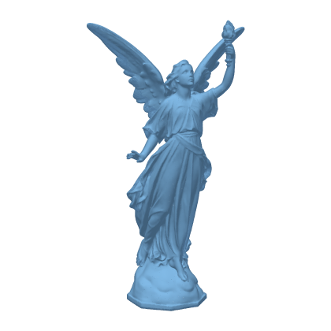 | **Lucy**<br><sub>`lucy`</sub><br><sub>lucy, angel, statue, stanford, classic, test-model</sub> | Geometry<br><sub>Stanford 3DSR (attribution)</sub> | Object | ~10k · 320 kB<br>~100k · 3.2 MB<br>~500k · 16.0 MB<br>~1M · 32.0 MB | [10k](https://raw.githubusercontent.com/marcelpadilla/splats/main/data/lucy/lucy_10k.splat) · [100k](https://raw.githubusercontent.com/marcelpadilla/splats/main/data/lucy/lucy_100k.splat) · [500k](https://raw.githubusercontent.com/marcelpadilla/splats/main/data/lucy/lucy_500k.splat) · [1m](https://raw.githubusercontent.com/marcelpadilla/splats/main/data/lucy/lucy_1m.splat)<br><sub>[meta](data/lucy/meta.json)</sub> |
| 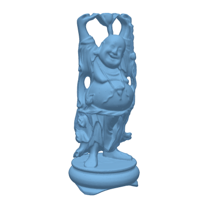 | **Happy Buddha**<br><sub>`happy`</sub><br><sub>buddha, happy-buddha, stanford, classic, test-model, detailed</sub> | Geometry<br><sub>Stanford 3DSR (attribution)</sub> | Object | ~10k · 320 kB<br>~100k · 3.2 MB<br>~500k · 16.0 MB<br>~1M · 32.0 MB | [10k](https://raw.githubusercontent.com/marcelpadilla/splats/main/data/happy/happy_10k.splat) · [100k](https://raw.githubusercontent.com/marcelpadilla/splats/main/data/happy/happy_100k.splat) · [500k](https://raw.githubusercontent.com/marcelpadilla/splats/main/data/happy/happy_500k.splat) · [1m](https://raw.githubusercontent.com/marcelpadilla/splats/main/data/happy/happy_1m.splat)<br><sub>[meta](data/happy/meta.json)</sub> |
| 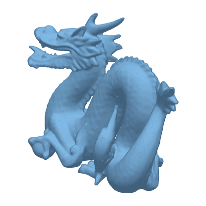 | **Stanford Dragon**<br><sub>`dragon`</sub><br><sub>dragon, stanford, classic, test-model, detailed</sub> | Geometry<br><sub>Stanford 3DSR (attribution)</sub> | Object | ~10k · 320 kB<br>~100k · 3.2 MB<br>~500k · 16.0 MB<br>~1M · 32.0 MB | [10k](https://raw.githubusercontent.com/marcelpadilla/splats/main/data/dragon/dragon_10k.splat) · [100k](https://raw.githubusercontent.com/marcelpadilla/splats/main/data/dragon/dragon_100k.splat) · [500k](https://raw.githubusercontent.com/marcelpadilla/splats/main/data/dragon/dragon_500k.splat) · [1m](https://raw.githubusercontent.com/marcelpadilla/splats/main/data/dragon/dragon_1m.splat)<br><sub>[meta](data/dragon/meta.json)</sub> |
| 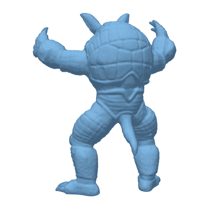 | **Armadillo**<br><sub>`armadillo`</sub><br><sub>armadillo, stanford, classic, test-model, organic</sub> | Geometry<br><sub>Stanford 3DSR (attribution)</sub> | Object | ~10k · 320 kB<br>~100k · 3.2 MB<br>~500k · 16.0 MB<br>~1M · 32.0 MB | [10k](https://raw.githubusercontent.com/marcelpadilla/splats/main/data/armadillo/armadillo_10k.splat) · [100k](https://raw.githubusercontent.com/marcelpadilla/splats/main/data/armadillo/armadillo_100k.splat) · [500k](https://raw.githubusercontent.com/marcelpadilla/splats/main/data/armadillo/armadillo_500k.splat) · [1m](https://raw.githubusercontent.com/marcelpadilla/splats/main/data/armadillo/armadillo_1m.splat)<br><sub>[meta](data/armadillo/meta.json)</sub> |
| 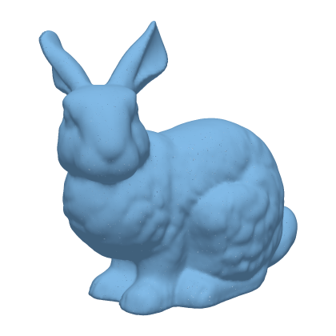 | **Stanford Bunny**<br><sub>`stanford_bunny`</sub><br><sub>bunny, stanford-bunny, classic, test-model</sub> | Geometry<br><sub>Stanford 3DSR (attribution)</sub> | Object | ~10k · 320 kB<br>~100k · 3.2 MB<br>~500k · 16.0 MB<br>~1M · 32.0 MB | [10k](https://raw.githubusercontent.com/marcelpadilla/splats/main/data/stanford_bunny/stanford_bunny_10k.splat) · [100k](https://raw.githubusercontent.com/marcelpadilla/splats/main/data/stanford_bunny/stanford_bunny_100k.splat) · [500k](https://raw.githubusercontent.com/marcelpadilla/splats/main/data/stanford_bunny/stanford_bunny_500k.splat) · [1m](https://raw.githubusercontent.com/marcelpadilla/splats/main/data/stanford_bunny/stanford_bunny_1m.splat)<br><sub>[meta](data/stanford_bunny/meta.json)</sub> |
| 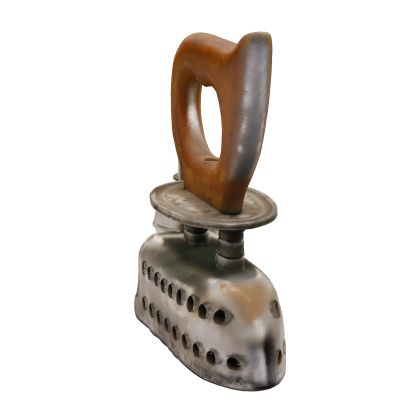 | **Charcoal iron (generated)**<br><sub>`charcoal_iron_generated`</sub><br><sub>iron, flat-iron, laundry, antique, tool, generated, ai, single-image</sub> | Generated<br><sub>As-is (no warranty)</sub> | Object | ~262k · 8.4 MB | [.splat](https://raw.githubusercontent.com/marcelpadilla/splats/main/data/charcoal_iron_generated/charcoal_iron_generated.splat) · [meta](data/charcoal_iron_generated/meta.json) |
| 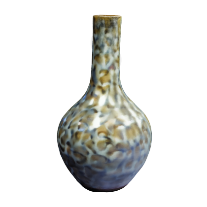 | **Bottle vase (generated)**<br><sub>`bottle_vase_generated`</sub><br><sub>vase, bottle-vase, ceramic, glaze, generated, ai, single-image</sub> | Generated<br><sub>As-is (no warranty)</sub> | Object | ~262k · 8.4 MB | [.splat](https://raw.githubusercontent.com/marcelpadilla/splats/main/data/bottle_vase_generated/bottle_vase_generated.splat) · [meta](data/bottle_vase_generated/meta.json) |
| 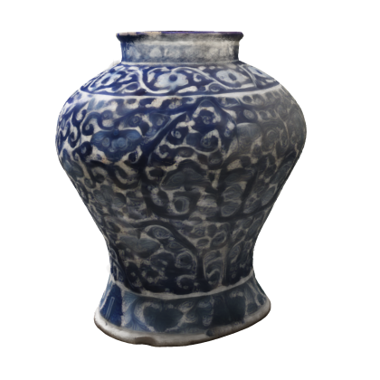 | **Blue-and-white jar (generated)**<br><sub>`blue_white_jar_generated`</sub><br><sub>jar, vase, ceramic, blue-and-white, pottery, generated, ai, single-image</sub> | Generated<br><sub>As-is (no warranty)</sub> | Object | ~262k · 8.4 MB | [.splat](https://raw.githubusercontent.com/marcelpadilla/splats/main/data/blue_white_jar_generated/blue_white_jar_generated.splat) · [meta](data/blue_white_jar_generated/meta.json) |
| 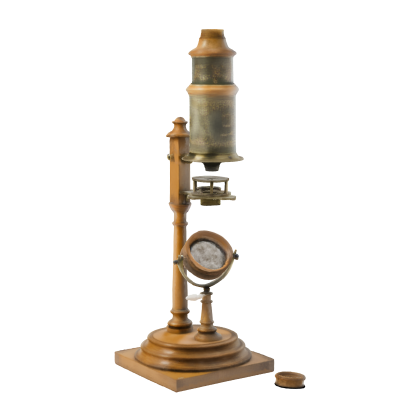 | **Brass microscope (generated)**<br><sub>`brass_microscope_generated`</sub><br><sub>microscope, brass, instrument, science, antique, generated, ai, single-image</sub> | Generated<br><sub>As-is (no warranty)</sub> | Object | ~262k · 8.4 MB | [.splat](https://raw.githubusercontent.com/marcelpadilla/splats/main/data/brass_microscope_generated/brass_microscope_generated.splat) · [meta](data/brass_microscope_generated/meta.json) |
| 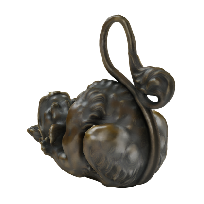 | **Bronze oil lamp (generated)**<br><sub>`bronze_oil_lamp_generated`</sub><br><sub>oil-lamp, bronze, antique, light, animal-form, generated, ai, single-image</sub> | Generated<br><sub>As-is (no warranty)</sub> | Object | ~262k · 8.4 MB | [.splat](https://raw.githubusercontent.com/marcelpadilla/splats/main/data/bronze_oil_lamp_generated/bronze_oil_lamp_generated.splat) · [meta](data/bronze_oil_lamp_generated/meta.json) |
| 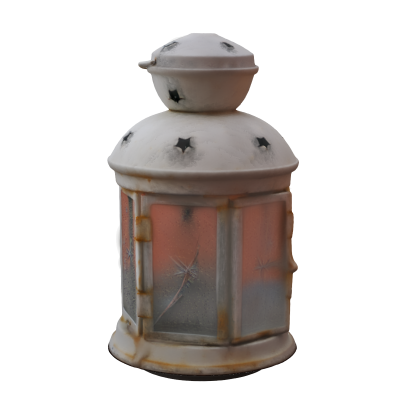 | **Candle lantern (generated)**<br><sub>`candle_lantern_generated`</sub><br><sub>lantern, candle, glass, metal, light, generated, ai, single-image</sub> | Generated<br><sub>As-is (no warranty)</sub> | Object | ~262k · 8.4 MB | [.splat](https://raw.githubusercontent.com/marcelpadilla/splats/main/data/candle_lantern_generated/candle_lantern_generated.splat) · [meta](data/candle_lantern_generated/meta.json) |
| 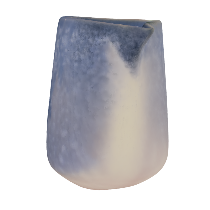 | **Ceramic pitcher (generated)**<br><sub>`ceramic_pitcher_generated`</sub><br><sub>pitcher, jug, ceramic, blue, kitchen, generated, ai, single-image</sub> | Generated<br><sub>As-is (no warranty)</sub> | Object | ~262k · 8.4 MB | [.splat](https://raw.githubusercontent.com/marcelpadilla/splats/main/data/ceramic_pitcher_generated/ceramic_pitcher_generated.splat) · [meta](data/ceramic_pitcher_generated/meta.json) |
| 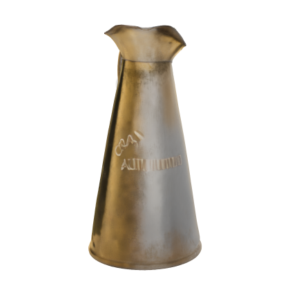 | **Brass jug (generated)**<br><sub>`brass_jug_generated`</sub><br><sub>jug, brass, vessel, kitchen, generated, ai, single-image</sub> | Generated<br><sub>As-is (no warranty)</sub> | Object | ~262k · 8.4 MB | [.splat](https://raw.githubusercontent.com/marcelpadilla/splats/main/data/brass_jug_generated/brass_jug_generated.splat) · [meta](data/brass_jug_generated/meta.json) |
|  | **Alarm clock (generated)**<br><sub>`alarm_clock_generated`</sub><br><sub>clock, alarm-clock, timepiece, red, generated, ai, single-image</sub> | Generated<br><sub>As-is (no warranty)</sub> | Object | ~262k · 8.4 MB | [.splat](https://raw.githubusercontent.com/marcelpadilla/splats/main/data/alarm_clock_generated/alarm_clock_generated.splat) · [meta](data/alarm_clock_generated/meta.json) |
| 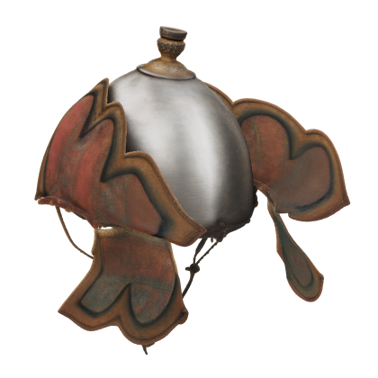 | **Cavalry helmet (generated)**<br><sub>`cavalry_helmet_generated`</sub><br><sub>helmet, armour, cavalry, painted, historical, generated, ai, single-image</sub> | Generated<br><sub>As-is (no warranty)</sub> | Object | ~262k · 8.4 MB | [.splat](https://raw.githubusercontent.com/marcelpadilla/splats/main/data/cavalry_helmet_generated/cavalry_helmet_generated.splat) · [meta](data/cavalry_helmet_generated/meta.json) |
| 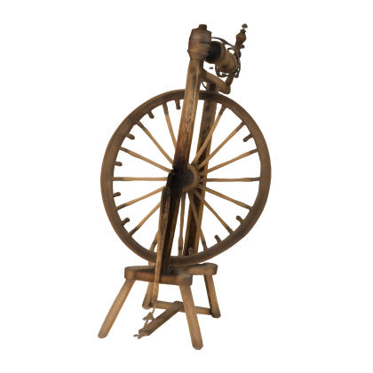 | **Spinning wheel (generated)**<br><sub>`spinning_wheel_generated`</sub><br><sub>spinning-wheel, wheel, textile, tool, wood, generated, ai, single-image</sub> | Generated<br><sub>As-is (no warranty)</sub> | Object | ~262k · 8.4 MB | [.splat](https://raw.githubusercontent.com/marcelpadilla/splats/main/data/spinning_wheel_generated/spinning_wheel_generated.splat) · [meta](data/spinning_wheel_generated/meta.json) |
| 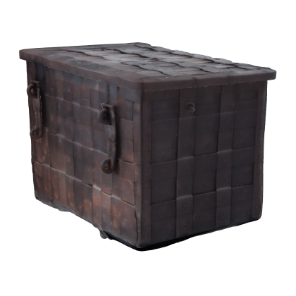 | **Iron-bound strongbox (generated)**<br><sub>`strongbox_generated`</sub><br><sub>strongbox, chest, iron, lock, furniture, generated, ai, single-image</sub> | Generated<br><sub>As-is (no warranty)</sub> | Object | ~262k · 8.4 MB | [.splat](https://raw.githubusercontent.com/marcelpadilla/splats/main/data/strongbox_generated/strongbox_generated.splat) · [meta](data/strongbox_generated/meta.json) |
| 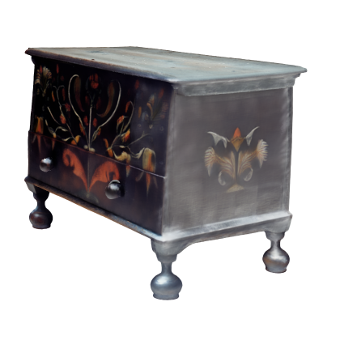 | **Painted chest (generated)**<br><sub>`painted_chest_generated`</sub><br><sub>chest, trunk, furniture, painted, folk-art, generated, ai, single-image</sub> | Generated<br><sub>As-is (no warranty)</sub> | Object | ~262k · 8.4 MB | [.splat](https://raw.githubusercontent.com/marcelpadilla/splats/main/data/painted_chest_generated/painted_chest_generated.splat) · [meta](data/painted_chest_generated/meta.json) |
|  | **Garden stool (generated)**<br><sub>`garden_stool_generated`</sub><br><sub>stool, garden-stool, ceramic, furniture, seat, generated, ai, single-image</sub> | Generated<br><sub>As-is (no warranty)</sub> | Object | ~262k · 8.4 MB | [.splat](https://raw.githubusercontent.com/marcelpadilla/splats/main/data/garden_stool_generated/garden_stool_generated.splat) · [meta](data/garden_stool_generated/meta.json) |
|  | **Rolltop desk (generated)**<br><sub>`rolltop_desk_generated`</sub><br><sub>desk, rolltop, furniture, wood, writing, generated, ai, single-image</sub> | Generated<br><sub>As-is (no warranty)</sub> | Object | ~262k · 8.4 MB | [.splat](https://raw.githubusercontent.com/marcelpadilla/splats/main/data/rolltop_desk_generated/rolltop_desk_generated.splat) · [meta](data/rolltop_desk_generated/meta.json) |
|  | **Windsor side chair (generated)**<br><sub>`windsor_chair_generated`</sub><br><sub>chair, windsor, furniture, wood, generated, ai, single-image</sub> | Generated<br><sub>As-is (no warranty)</sub> | Object | ~262k · 8.4 MB | [.splat](https://raw.githubusercontent.com/marcelpadilla/splats/main/data/windsor_chair_generated/windsor_chair_generated.splat) · [meta](data/windsor_chair_generated/meta.json) |
|  | **Windsor armchair (generated)**<br><sub>`windsor_armchair_generated`</sub><br><sub>chair, windsor, armchair, furniture, wood, generated, ai, single-image</sub> | Generated<br><sub>As-is (no warranty)</sub> | Object | ~262k · 8.4 MB | [.splat](https://raw.githubusercontent.com/marcelpadilla/splats/main/data/windsor_armchair_generated/windsor_armchair_generated.splat) · [meta](data/windsor_armchair_generated/meta.json) |
|  | **Striped gourd (generated)**<br><sub>`striped_gourd_generated`</sub><br><sub>gourd, squash, vegetable, food, generated, ai, single-image</sub> | Generated<br><sub>As-is (no warranty)</sub> | Object | ~262k · 8.4 MB | [.splat](https://raw.githubusercontent.com/marcelpadilla/splats/main/data/striped_gourd_generated/striped_gourd_generated.splat) · [meta](data/striped_gourd_generated/meta.json) |
|  | **Red squash (generated)**<br><sub>`red_squash_generated`</sub><br><sub>squash, pumpkin, gourd, vegetable, food, generated, ai, single-image</sub> | Generated<br><sub>As-is (no warranty)</sub> | Object | ~262k · 8.4 MB | [.splat](https://raw.githubusercontent.com/marcelpadilla/splats/main/data/red_squash_generated/red_squash_generated.splat) · [meta](data/red_squash_generated/meta.json) |
|  | **Bismuth crystal (generated)**<br><sub>`bismuth_crystal_generated`</sub><br><sub>bismuth, crystal, mineral, geometry, generated, ai, single-image</sub> | Generated<br><sub>As-is (no warranty)</sub> | Object | ~262k · 8.4 MB | [.splat](https://raw.githubusercontent.com/marcelpadilla/splats/main/data/bismuth_crystal_generated/bismuth_crystal_generated.splat) · [meta](data/bismuth_crystal_generated/meta.json) |
|  | **Stag beetle (generated)**<br><sub>`stag_beetle_generated`</sub><br><sub>beetle, stag-beetle, insect, animal, generated, ai, single-image</sub> | Generated<br><sub>As-is (no warranty)</sub> | Object | ~262k · 8.4 MB | [.splat](https://raw.githubusercontent.com/marcelpadilla/splats/main/data/stag_beetle_generated/stag_beetle_generated.splat) · [meta](data/stag_beetle_generated/meta.json) |
|  | **Ghost crab (generated)**<br><sub>`ghost_crab_generated`</sub><br><sub>crab, ghost-crab, crustacean, animal, generated, ai, single-image</sub> | Generated<br><sub>As-is (no warranty)</sub> | Object | ~262k · 8.4 MB | [.splat](https://raw.githubusercontent.com/marcelpadilla/splats/main/data/ghost_crab_generated/ghost_crab_generated.splat) · [meta](data/ghost_crab_generated/meta.json) |
|  | **Crab (generated)**<br><sub>`crab_generated`</sub><br><sub>crab, crustacean, animal, shell, generated, ai, single-image</sub> | Generated<br><sub>As-is (no warranty)</sub> | Object | ~262k · 8.4 MB | [.splat](https://raw.githubusercontent.com/marcelpadilla/splats/main/data/crab_generated/crab_generated.splat) · [meta](data/crab_generated/meta.json) |
|  | **Mallard (generated)**<br><sub>`mallard_generated`</sub><br><sub>duck, mallard, bird, animal, generated, ai, single-image</sub> | Generated<br><sub>As-is (no warranty)</sub> | Object | ~262k · 8.4 MB | [.splat](https://raw.githubusercontent.com/marcelpadilla/splats/main/data/mallard_generated/mallard_generated.splat) · [meta](data/mallard_generated/meta.json) |
|  | **Jackdaw (generated)**<br><sub>`jackdaw_generated`</sub><br><sub>jackdaw, corvid, bird, animal, generated, ai, single-image</sub> | Generated<br><sub>As-is (no warranty)</sub> | Object | ~262k · 8.4 MB | [.splat](https://raw.githubusercontent.com/marcelpadilla/splats/main/data/jackdaw_generated/jackdaw_generated.splat) · [meta](data/jackdaw_generated/meta.json) |
|  | **Ritual hand bell (generated)**<br><sub>`hand_bell_generated`</sub><br><sub>bell, hand-bell, dril-bu, bronze, ritual, instrument, generated, ai, single-image</sub> | Generated<br><sub>As-is (no warranty)</sub> | Object | ~262k · 8.4 MB | [.splat](https://raw.githubusercontent.com/marcelpadilla/splats/main/data/hand_bell_generated/hand_bell_generated.splat) · [meta](data/hand_bell_generated/meta.json) |
|  | **Double-belled euphonium (generated)**<br><sub>`brass_horn_generated`</sub><br><sub>euphonium, horn, brass, instrument, music, generated, ai, single-image</sub> | Generated<br><sub>As-is (no warranty)</sub> | Object | ~262k · 8.4 MB | [.splat](https://raw.githubusercontent.com/marcelpadilla/splats/main/data/brass_horn_generated/brass_horn_generated.splat) · [meta](data/brass_horn_generated/meta.json) |
|  | **Sewing machine (generated)**<br><sub>`sewing_machine_generated`</sub><br><sub>sewing-machine, singer, machine, vintage, tool, generated, ai, single-image</sub> | Generated<br><sub>As-is (no warranty)</sub> | Object | ~262k · 8.4 MB | [.splat](https://raw.githubusercontent.com/marcelpadilla/splats/main/data/sewing_machine_generated/sewing_machine_generated.splat) · [meta](data/sewing_machine_generated/meta.json) |
|  | **Cat (generated)**<br><sub>`cat_generated`</sub><br><sub>cat, animal, pet, mammal, generated, ai, single-image</sub> | Generated<br><sub>As-is (no warranty)</sub> | Object | ~262k · 8.4 MB | [.splat](https://raw.githubusercontent.com/marcelpadilla/splats/main/data/cat_generated/cat_generated.splat) · [meta](data/cat_generated/meta.json) |
|  | **Cactus (generated)**<br><sub>`cactus_generated`</sub><br><sub>cactus, plant, succulent, pot, nature, generated, ai, single-image</sub> | Generated<br><sub>As-is (no warranty)</sub> | Object | ~262k · 8.4 MB | [.splat](https://raw.githubusercontent.com/marcelpadilla/splats/main/data/cactus_generated/cactus_generated.splat) · [meta](data/cactus_generated/meta.json) |
|  | **Watering can (generated)**<br><sub>`watering_can_generated`</sub><br><sub>watering-can, garden, metal, tool, generated, ai, single-image</sub> | Generated<br><sub>As-is (no warranty)</sub> | Object | ~262k · 8.4 MB | [.splat](https://raw.githubusercontent.com/marcelpadilla/splats/main/data/watering_can_generated/watering_can_generated.splat) · [meta](data/watering_can_generated/meta.json) |
|  | **Gramophone (generated)**<br><sub>`gramophone_generated`</sub><br><sub>gramophone, phonograph, music, vintage, machine, generated, ai, single-image</sub> | Generated<br><sub>As-is (no warranty)</sub> | Object | ~262k · 8.4 MB | [.splat](https://raw.githubusercontent.com/marcelpadilla/splats/main/data/gramophone_generated/gramophone_generated.splat) · [meta](data/gramophone_generated/meta.json) |
|  | **Folding camera (generated)**<br><sub>`folding_camera_generated`</sub><br><sub>camera, photography, vintage, folding-camera, generated, ai, single-image</sub> | Generated<br><sub>As-is (no warranty)</sub> | Object | ~262k · 8.4 MB | [.splat](https://raw.githubusercontent.com/marcelpadilla/splats/main/data/folding_camera_generated/folding_camera_generated.splat) · [meta](data/folding_camera_generated/meta.json) |
|  | **Jasperware teapot (generated)**<br><sub>`wedgwood_teapot_generated`</sub><br><sub>teapot, ceramic, wedgwood, jasperware, tableware, kitchen, generated, ai, single-image</sub> | Generated<br><sub>As-is (no warranty)</sub> | Object | ~262k · 8.4 MB | [.splat](https://raw.githubusercontent.com/marcelpadilla/splats/main/data/wedgwood_teapot_generated/wedgwood_teapot_generated.splat) · [meta](data/wedgwood_teapot_generated/meta.json) |
|  | **Pineapple (generated)**<br><sub>`pineapple_generated`</sub><br><sub>pineapple, fruit, food, plant, nature, generated, ai, single-image</sub> | Generated<br><sub>As-is (no warranty)</sub> | Object | ~262k · 8.4 MB | [.splat](https://raw.githubusercontent.com/marcelpadilla/splats/main/data/pineapple_generated/pineapple_generated.splat) · [meta](data/pineapple_generated/meta.json) |
|  | **Fly agaric mushroom (generated)**<br><sub>`fly_agaric_generated`</sub><br><sub>mushroom, fungus, fly-agaric, amanita, nature, generated, ai, single-image</sub> | Generated<br><sub>As-is (no warranty)</sub> | Object | ~262k · 8.4 MB | [.splat](https://raw.githubusercontent.com/marcelpadilla/splats/main/data/fly_agaric_generated/fly_agaric_generated.splat) · [meta](data/fly_agaric_generated/meta.json) |
|  | **Snail (generated)**<br><sub>`snail_generated`</sub><br><sub>snail, shell, animal, mollusc, nature, generated, ai, single-image</sub> | Generated<br><sub>As-is (no warranty)</sub> | Object | ~262k · 8.4 MB | [.splat](https://raw.githubusercontent.com/marcelpadilla/splats/main/data/snail_generated/snail_generated.splat) · [meta](data/snail_generated/meta.json) |
|  | **Elephant (generated)**<br><sub>`elephant_generated`</sub><br><sub>elephant, animal, mammal, nature, generated, ai, single-image</sub> | Generated<br><sub>As-is (no warranty)</sub> | Object | ~262k · 8.4 MB | [.splat](https://raw.githubusercontent.com/marcelpadilla/splats/main/data/elephant_generated/elephant_generated.splat) · [meta](data/elephant_generated/meta.json) |
|  | **Horse (generated)**<br><sub>`horse_generated`</sub><br><sub>horse, animal, mammal, nature, generated, ai, single-image</sub> | Generated<br><sub>As-is (no warranty)</sub> | Object | ~262k · 8.4 MB | [.splat](https://raw.githubusercontent.com/marcelpadilla/splats/main/data/horse_generated/horse_generated.splat) · [meta](data/horse_generated/meta.json) |
|  | **Kiwi (generated)**<br><sub>`kiwi_generated`</sub><br><sub>kiwi, bird, animal, nature, new-zealand, generated, ai, single-image</sub> | Generated<br><sub>As-is (no warranty)</sub> | Object | ~262k · 8.4 MB | [.splat](https://raw.githubusercontent.com/marcelpadilla/splats/main/data/kiwi_generated/kiwi_generated.splat) · [meta](data/kiwi_generated/meta.json) |
|  | **Goldfinch (generated)**<br><sub>`goldfinch_generated`</sub><br><sub>goldfinch, bird, animal, nature, generated, ai, single-image</sub> | Generated<br><sub>As-is (no warranty)</sub> | Object | ~262k · 8.4 MB | [.splat](https://raw.githubusercontent.com/marcelpadilla/splats/main/data/goldfinch_generated/goldfinch_generated.splat) · [meta](data/goldfinch_generated/meta.json) |
|  | **Blue morpho butterfly (generated)**<br><sub>`morpho_butterfly_generated`</sub><br><sub>butterfly, morpho, insect, animal, nature, generated, ai, single-image</sub> | Generated<br><sub>As-is (no warranty)</sub> | Object | ~262k · 8.4 MB | [.splat](https://raw.githubusercontent.com/marcelpadilla/splats/main/data/morpho_butterfly_generated/morpho_butterfly_generated.splat) · [meta](data/morpho_butterfly_generated/meta.json) |
|  | **Bonsai tree (generated)**<br><sub>`bonsai_generated`</sub><br><sub>tree, bonsai, plant, nature, pot, generated, ai, single-image</sub> | Generated<br><sub>As-is (no warranty)</sub> | Object | ~262k · 8.4 MB | [.splat](https://raw.githubusercontent.com/marcelpadilla/splats/main/data/bonsai_generated/bonsai_generated.splat) · [meta](data/bonsai_generated/meta.json) |
|  | **Dog (generated)**<br><sub>`dog_generated`</sub><br><sub>dog, animal, pet, mammal, ridgeback, generated, ai, single-image</sub> | Generated<br><sub>As-is (no warranty)</sub> | Object | ~262k · 8.4 MB | [.splat](https://raw.githubusercontent.com/marcelpadilla/splats/main/data/dog_generated/dog_generated.splat) · [meta](data/dog_generated/meta.json) |
|  | **Kilim rug (generated)**<br><sub>`kilim_rug_generated`</sub><br><sub>rug, carpet, kilim, textile, weaving, generated, ai, single-image</sub> | Generated<br><sub>As-is (no warranty)</sub> | Object | ~261k · 8.4 MB | [.splat](https://raw.githubusercontent.com/marcelpadilla/splats/main/data/kilim_rug_generated/kilim_rug_generated.splat) · [meta](data/kilim_rug_generated/meta.json) |
|  | **Doll's bed (generated)**<br><sub>`dolls_bed_generated`</sub><br><sub>bed, furniture, toy, dolls-house, miniature, generated, ai, single-image</sub> | Generated<br><sub>As-is (no warranty)</sub> | Object | ~262k · 8.4 MB | [.splat](https://raw.githubusercontent.com/marcelpadilla/splats/main/data/dolls_bed_generated/dolls_bed_generated.splat) · [meta](data/dolls_bed_generated/meta.json) |
|  | **Tiffany table lamp (generated)**<br><sub>`tiffany_lamp_generated`</sub><br><sub>lamp, lampshade, tiffany, glass, lighting, furniture, generated, ai, single-image</sub> | Generated<br><sub>As-is (no warranty)</sub> | Object | ~262k · 8.4 MB | [.splat](https://raw.githubusercontent.com/marcelpadilla/splats/main/data/tiffany_lamp_generated/tiffany_lamp_generated.splat) · [meta](data/tiffany_lamp_generated/meta.json) |
|  | **Vintage motorcycle (generated)**<br><sub>`vintage_motorcycle_generated`</sub><br><sub>motorcycle, vehicle, vintage, machine, bmw, generated, ai, single-image</sub> | Generated<br><sub>As-is (no warranty)</sub> | Object | ~262k · 8.4 MB | [.splat](https://raw.githubusercontent.com/marcelpadilla/splats/main/data/vintage_motorcycle_generated/vintage_motorcycle_generated.splat) · [meta](data/vintage_motorcycle_generated/meta.json) |
|  | **Teacup (generated)**<br><sub>`teacup_generated`</sub><br><sub>cup, teacup, ceramic, tableware, kitchen, generated, ai, single-image</sub> | Generated<br><sub>As-is (no warranty)</sub> | Object | ~262k · 8.4 MB | [.splat](https://raw.githubusercontent.com/marcelpadilla/splats/main/data/teacup_generated/teacup_generated.splat) · [meta](data/teacup_generated/meta.json) |
|  | **Log cabin (generated)**<br><sub>`log_cabin_generated`</sub><br><sub>cabin, house, building, wood, vernacular, architecture, generated, ai, single-image</sub> | Generated<br><sub>As-is (no warranty)</sub> | Object | ~262k · 8.4 MB | [.splat](https://raw.githubusercontent.com/marcelpadilla/splats/main/data/log_cabin_generated/log_cabin_generated.splat) · [meta](data/log_cabin_generated/meta.json) |
|  | **Bentwood chair (generated)**<br><sub>`bentwood_chair_generated`</sub><br><sub>chair, furniture, bentwood, vintage, generated, ai, single-image</sub> | Generated<br><sub>As-is (no warranty)</sub> | Object | ~262k · 8.4 MB | [.splat](https://raw.githubusercontent.com/marcelpadilla/splats/main/data/bentwood_chair_generated/bentwood_chair_generated.splat) · [meta](data/bentwood_chair_generated/meta.json) |
|  | **Fordson tractor (generated)**<br><sub>`tractor_generated`</sub><br><sub>tractor, vehicle, farm, machine, vintage, fordson, generated, ai, single-image</sub> | Generated<br><sub>As-is (no warranty)</sub> | Object | ~262k · 8.4 MB | [.splat](https://raw.githubusercontent.com/marcelpadilla/splats/main/data/tractor_generated/tractor_generated.splat) · [meta](data/tractor_generated/meta.json) |
|  | **Manual typewriter (generated)**<br><sub>`typewriter_generated`</sub><br><sub>typewriter, machine, vintage, office, generated, ai, single-image</sub> | Generated<br><sub>As-is (no warranty)</sub> | Object | ~262k · 8.4 MB | [.splat](https://raw.githubusercontent.com/marcelpadilla/splats/main/data/typewriter_generated/typewriter_generated.splat) · [meta](data/typewriter_generated/meta.json) |
|  | **Toy accordion (generated)**<br><sub>`toy_accordion_generated`</sub><br><sub>accordion, instrument, toy, music, generated, ai, single-image</sub> | Generated<br><sub>As-is (no warranty)</sub> | Object | ~262k · 8.4 MB | [.splat](https://raw.githubusercontent.com/marcelpadilla/splats/main/data/toy_accordion_generated/toy_accordion_generated.splat) · [meta](data/toy_accordion_generated/meta.json) |
|  | **Galapagos tortoise (generated)**<br><sub>`tortoise_generated`</sub><br><sub>tortoise, animal, reptile, nature, generated, ai, single-image</sub> | Generated<br><sub>As-is (no warranty)</sub> | Object | ~262k · 8.4 MB | [.splat](https://raw.githubusercontent.com/marcelpadilla/splats/main/data/tortoise_generated/tortoise_generated.splat) · [meta](data/tortoise_generated/meta.json) |
|  | **Leaning Tower of Pisa (generated)**<br><sub>`pisa_tower_generated`</sub><br><sub>leaning-tower-of-pisa, pisa, tower, campanile, landmark, architecture, generated, ai, single-image</sub> | Generated<br><sub>As-is (no warranty)</sub> | Object | ~262k · 8.4 MB | [.splat](https://raw.githubusercontent.com/marcelpadilla/splats/main/data/pisa_tower_generated/pisa_tower_generated.splat) · [meta](data/pisa_tower_generated/meta.json) |
|  | **Eiffel Tower (generated)**<br><sub>`eiffel_generated`</sub><br><sub>eiffel-tower, tower, landmark, architecture, generated, ai, single-image</sub> | Generated<br><sub>As-is (no warranty)</sub> | Object | ~262k · 8.4 MB | [.splat](https://raw.githubusercontent.com/marcelpadilla/splats/main/data/eiffel_generated/eiffel_generated.splat) · [meta](data/eiffel_generated/meta.json) |
|  | **Abalone shell**<br><sub>`shell`</sub><br><sub>shell, abalone, nacre, mother-of-pearl, iridescent, organic, natural</sub> | Scanned<br><sub>CC-BY-4.0</sub> | Object | ~187k · 6.0 MB | [.splat](https://raw.githubusercontent.com/marcelpadilla/splats/main/data/shell/shell.splat) · [meta](data/shell/meta.json) |
|  | **Ring**<br><sub>`ring`</sub><br><sub>primitive, ring, torus</sub> | Geometry<br><sub>CC0-1.0</sub> | Object | ~10k · 320 kB<br>~100k · 3.2 MB<br>~500k · 16.0 MB<br>~1M · 32.0 MB | [10k](https://raw.githubusercontent.com/marcelpadilla/splats/main/data/ring/ring_10k.splat) · [100k](https://raw.githubusercontent.com/marcelpadilla/splats/main/data/ring/ring_100k.splat) · [500k](https://raw.githubusercontent.com/marcelpadilla/splats/main/data/ring/ring_500k.splat) · [1m](https://raw.githubusercontent.com/marcelpadilla/splats/main/data/ring/ring_1m.splat)<br><sub>[meta](data/ring/meta.json)</sub> |
|  | **Torus**<br><sub>`torus`</sub><br><sub>primitive, torus, donut</sub> | Geometry<br><sub>CC0-1.0</sub> | Object | ~10k · 320 kB<br>~100k · 3.2 MB<br>~500k · 16.0 MB<br>~1M · 32.0 MB | [10k](https://raw.githubusercontent.com/marcelpadilla/splats/main/data/torus/torus_10k.splat) · [100k](https://raw.githubusercontent.com/marcelpadilla/splats/main/data/torus/torus_100k.splat) · [500k](https://raw.githubusercontent.com/marcelpadilla/splats/main/data/torus/torus_500k.splat) · [1m](https://raw.githubusercontent.com/marcelpadilla/splats/main/data/torus/torus_1m.splat)<br><sub>[meta](data/torus/meta.json)</sub> |
|  | **Cylinder**<br><sub>`cylinder`</sub><br><sub>primitive, cylinder</sub> | Geometry<br><sub>CC0-1.0</sub> | Object | ~10k · 320 kB<br>~100k · 3.2 MB<br>~500k · 16.0 MB<br>~1M · 32.0 MB | [10k](https://raw.githubusercontent.com/marcelpadilla/splats/main/data/cylinder/cylinder_10k.splat) · [100k](https://raw.githubusercontent.com/marcelpadilla/splats/main/data/cylinder/cylinder_100k.splat) · [500k](https://raw.githubusercontent.com/marcelpadilla/splats/main/data/cylinder/cylinder_500k.splat) · [1m](https://raw.githubusercontent.com/marcelpadilla/splats/main/data/cylinder/cylinder_1m.splat)<br><sub>[meta](data/cylinder/meta.json)</sub> |
|  | **Utah Teapot**<br><sub>`teapot`</sub><br><sub>teapot, utah, classic, newell</sub> | Geometry<br><sub>Public Domain</sub> | Object | ~10k · 320 kB<br>~100k · 3.2 MB<br>~500k · 16.0 MB<br>~1M · 32.0 MB | [10k](https://raw.githubusercontent.com/marcelpadilla/splats/main/data/teapot/teapot_10k.splat) · [100k](https://raw.githubusercontent.com/marcelpadilla/splats/main/data/teapot/teapot_100k.splat) · [500k](https://raw.githubusercontent.com/marcelpadilla/splats/main/data/teapot/teapot_500k.splat) · [1m](https://raw.githubusercontent.com/marcelpadilla/splats/main/data/teapot/teapot_1m.splat)<br><sub>[meta](data/teapot/meta.json)</sub> |
|  | **Bob**<br><sub>`bob`</sub><br><sub>blob, keenan-crane, classic, test-model</sub> | Geometry<br><sub>CC0-1.0</sub> | Object | ~10k · 320 kB<br>~100k · 3.2 MB<br>~500k · 16.0 MB<br>~1M · 32.0 MB | [10k](https://raw.githubusercontent.com/marcelpadilla/splats/main/data/bob/bob_10k.splat) · [100k](https://raw.githubusercontent.com/marcelpadilla/splats/main/data/bob/bob_100k.splat) · [500k](https://raw.githubusercontent.com/marcelpadilla/splats/main/data/bob/bob_500k.splat) · [1m](https://raw.githubusercontent.com/marcelpadilla/splats/main/data/bob/bob_1m.splat)<br><sub>[meta](data/bob/meta.json)</sub> |
|  | **Spot**<br><sub>`spot`</sub><br><sub>cow, keenan-crane, classic, test-model, cute</sub> | Geometry<br><sub>CC0-1.0</sub> | Object | ~10k · 320 kB<br>~100k · 3.2 MB<br>~500k · 16.0 MB<br>~1M · 32.0 MB | [10k](https://raw.githubusercontent.com/marcelpadilla/splats/main/data/spot/spot_10k.splat) · [100k](https://raw.githubusercontent.com/marcelpadilla/splats/main/data/spot/spot_100k.splat) · [500k](https://raw.githubusercontent.com/marcelpadilla/splats/main/data/spot/spot_500k.splat) · [1m](https://raw.githubusercontent.com/marcelpadilla/splats/main/data/spot/spot_1m.splat)<br><sub>[meta](data/spot/meta.json)</sub> |
|  | **Stanford bunny (generated)**<br><sub>`bunny_generated`</sub><br><sub>bunny, stanford-bunny, generated, ai, test-model, single-image</sub> | Generated<br><sub>As-is (no warranty)</sub> | Object | ~262k · 8.4 MB | [.splat](https://raw.githubusercontent.com/marcelpadilla/splats/main/data/bunny_generated/bunny_generated.splat) · [meta](data/bunny_generated/meta.json) |
|  | **Stanford bunny (rendered)**<br><sub>`bunny_render`</sub><br><sub>bunny, stanford-bunny, rendered, synthetic, test-model</sub> | Rendered<br><sub>CC-BY-3.0</sub> | Object | ~188k · 6.0 MB | [.splat](https://raw.githubusercontent.com/marcelpadilla/splats/main/data/bunny_render/bunny_render.splat) · [meta](data/bunny_render/meta.json) |
|  | **Houseplant (generated)**<br><sub>`plant_generated`</sub><br><sub>plant, houseplant, foliage, generated, ai, single-image</sub> | Generated<br><sub>As-is (no warranty)</sub> | Object | ~262k · 8.4 MB | [.splat](https://raw.githubusercontent.com/marcelpadilla/splats/main/data/plant_generated/plant_generated.splat) · [meta](data/plant_generated/meta.json) |
|  | **Textile ball**<br><sub>`textile_ball`</sub><br><sub>ball, textile, fabric, sphere, decor, bumpy</sub> | Scanned<br><sub>CC-BY-4.0</sub> | Object | ~384k · 12.3 MB | [.splat](https://raw.githubusercontent.com/marcelpadilla/splats/main/data/textile_ball/textile_ball.splat) · [meta](data/textile_ball/meta.json) |
|  | **Houseplant**<br><sub>`plant`</sub><br><sub>plant, houseplant, foliage, organic, indoor, glossy</sub> | Scanned<br><sub>CC-BY-4.0</sub> | Object | ~113k · 3.6 MB | [.splat](https://raw.githubusercontent.com/marcelpadilla/splats/main/data/plant/plant.splat) · [meta](data/plant/meta.json) |
|  | **Academic Tarot Cards box**<br><sub>`academic_tarot_cards`</sub><br><sub>box, packaging, cardboard, print, indoor, boxy</sub> | Scanned<br><sub>CC-BY-4.0</sub> | Object | ~114k · 3.7 MB | [.splat](https://raw.githubusercontent.com/marcelpadilla/splats/main/data/academic_tarot_cards/academic_tarot_cards.splat) · [meta](data/academic_tarot_cards/meta.json) |

<sub>109 objects · ~41M gaussians at the default level · 41 of them at four levels of detail · 2672.5 MB for every file · licenses per object (see Source)</sub>
<!-- inventory:end -->

The machine-readable index of all of this is
[`data/inventory.json`](data/inventory.json): one record per object with its
checksum, dimensions, tags, category and source method. It is the single source
of truth that drives the table above, the website, and the Python package.

## Format

One `.splat` per object, the antimatter15 packing: a header-less array of
32-byte records, so the gaussian count is exactly `filesize // 32`.

| bytes | type | meaning |
|---|---|---|
| `0:12` | 3x float32 | position x, y, z |
| `12:24` | 3x float32 | scale x, y, z, linear and already exponentiated |
| `24:28` | 4x uint8 | colour R, G, B, A, where A is opacity |
| `28:32` | 4x uint8 | rotation quaternion w, x, y, z, as `q * 128 + 128` |

Up is `-y`, following the Inria and Brush convention.

**Every object is normalized to the same size.** Its bounding box is centred on
the origin and its longest side is `1`, so any two objects load at the same
scale and each one fills the unit cube. Exactly 1 on the densest tier of each
object; the coarser tiers inherit that object's single scale factor rather than
being renormalized to their own box, so a viewer switching level of detail does
not see the object jump, and their longest side lands within about 1% of 1
(worst case `dragon_10k` at 0.989). This is a *relative* scale, not
a metric one: nothing here is in metres, and a mouse and a building are the same
size on purpose. If you need the real proportions of one object they are its own
business, not the dataset's. The normalization is a uniform scale, which
multiplies positions and per-gaussian scales together and leaves rotation,
opacity and colour untouched, so each object is unchanged in every respect except
how big it is. Each object's `meta.json` reports its resulting `extent`.

Spherical harmonics are dropped (SH degree 0), so there is no view-dependent
shading, but the files stay small and every browser viewer reads them.

There is nowhere inside a `.splat` to put metadata without breaking the
`filesize // 32` invariant every reader depends on, so metadata lives in
`data/inventory.json` and each object's `meta.json`, never in the splat itself.

## Citing

If you use these in your work, a citation is appreciated (and required by the
data license). The BibTeX is also available from Python as `splatset.citation()`.

<!-- citation:start -->
```bibtex
@misc{padilla_splats,
  author       = {Marcel Padilla},
  title        = {splats: a small collection of Gaussian splat objects},
  year         = {2026},
  note         = {Snapshot data-2026-08-11, 109 objects},
  howpublished = {\url{https://github.com/marcelpadilla/splats}}
}
```
<!-- citation:end -->

## Licensing

The data license depends on how each object was made (shown under its **Source**
in the table above, and in each object's `meta.json`):

- **Scanned objects are [CC-BY-4.0](LICENSE).** Use them for anything, including
  commercially. You must credit the author.
- **Geometry and rendered objects inherit the license of the mesh they came
  from.** Converting a mesh to splats does not launder its license. Of the 41,
  8 are CC0 or public domain and ask for nothing (Spot and Bob by Keenan Crane,
  the Utah teapot, the primitives), 19 are CC-BY and want their own author
  credited (not Marcel Padilla), 6 are the Stanford subset below, and 8 are
  **NonCommercial**. The rendered bunny is CC-BY-3.0 (Stanford Bunny STL by
  Makerbot, via Wikimedia Commons); credit that author as well.
- **Eight objects forbid commercial use.** `brucewick`, `cow`, `falconstatue`,
  `house`, `mushroom`, `strawberry`, `tower` and `well` are CC BY-NC, and
  `falconstatue` is also ShareAlike. They are in the collection because they are
  good geometry, but do not put them in a product. `find(open_license=True)`
  drops all eight.
- **The Stanford subset is free to use but is not Creative Commons.**
  `stanford_bunny`, `armadillo`, `dragon`, `happy`, `lucy` and `xyzrgb_dragon`
  come from the [Stanford 3D Scanning
  Repository](http://graphics.stanford.edu/data/3Dscanrep/), which permits use
  including in derivative and commercial work, but asks that you acknowledge the
  source and do not misrepresent the data. Credit *Stanford University Computer
  Graphics Laboratory* (and *XYZ RGB Inc.* for `xyzrgb_dragon`).
- **Generated objects are provided as-is, with no warranty of rights.** They were
  invented by an AI image-to-3D model whose training data is undisclosed, so their
  copyright status cannot be warranted and they are **not under CC-BY**. You are
  responsible for clearing any rights for your use.

`splatset.find(open_license=True)` keeps the 32 objects under a Creative Commons
or public-domain license: CC0 and public domain, which ask nothing, plus CC-BY,
which still **requires attribution**. It drops the NonCommercial eight, the
Stanford subset and the generated ones. It is a rights filter, not an
"attribution not required" filter; for that, take the CC0 and public-domain
objects only.

- **The code in `python/` is [0BSD](python/LICENSE).** No attribution required.

Credit line you can paste for one of the four **scanned** objects:

> Gaussian splat by Marcel Padilla, from https://github.com/marcelpadilla/splats, licensed CC-BY-4.0.

For every other object the author is someone else and the license may be a
different version, so build the line from that record instead: its `attribution`
field is already written for exactly this, and `license` gives the version.

```python
r = splatset.get("spot")
print(r["attribution"], "|", r["license"])
```

The license covers the capture, render or generation and the reconstruction, not
the industrial design of any object depicted.

## Layout

```
data/
  inventory.json          the machine-readable index, and the source of truth
  <id>/
    <id>.splat            the gaussians (a single-file object)
    <id>_<lod>.splat      or one file per level of detail (10k/100k/500k/1m)
    meta.json             provenance, pipeline, quality, caveats, every tier
    thumb.jpg             the gallery image above
python/                   the splatset package
LICENSE                   CC-BY-4.0, the license of the scanned objects
```

## Adding an object

1. Put `data/<id>/<id>.splat` (or one file per tier), its `meta.json` and a
   `thumb.jpg` in place.
2. Add an entry to `data/inventory.json`, including its SHA-256, `category`,
   `source_method` and `license`. A multi-resolution object also lists every
   tier under `lods` and names one in `default_lod`; the top-level
   `file`/`splats`/`bytes`/`sha256` must be that tier's, not a fifth file.
3. Run `python python/sync_inventory.py`, which refreshes the copy bundled in
   the package and regenerates the gallery and citation blocks above.
4. Run `python -m pytest python/tests` to confirm the checksums and counts agree,
   for every tier.

The website reads `data/inventory.json` straight from this repository, and
existing package installs pick up new objects with `splatset.refresh_inventory()`, so
neither needs a separate update.
